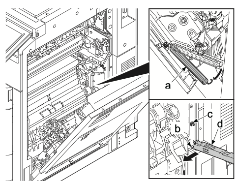
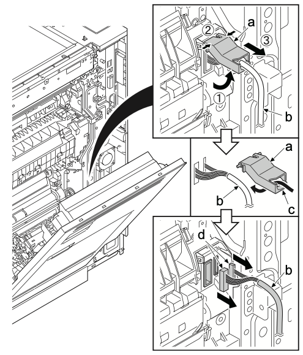
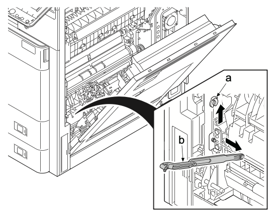
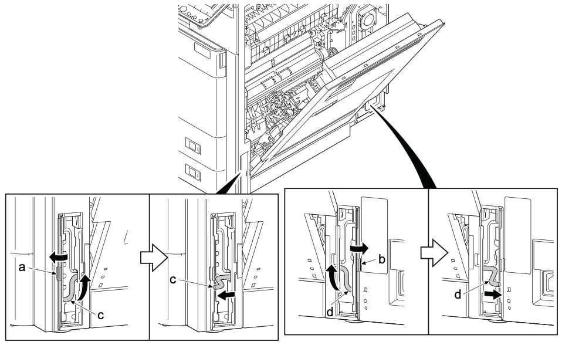
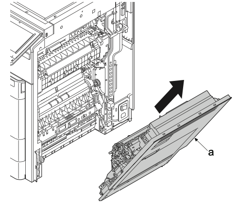
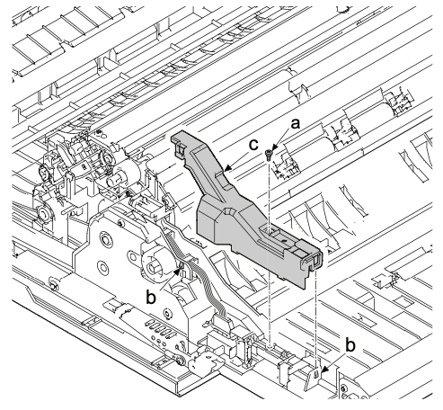
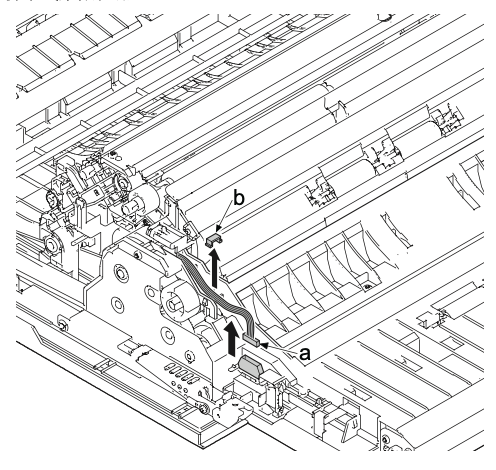
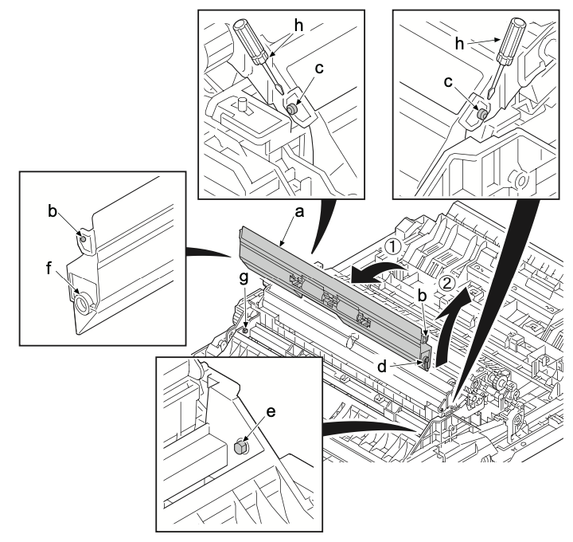
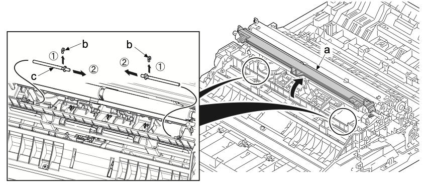
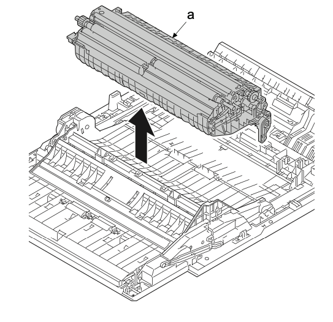

### (1-11)拆卸和安装右盖板组件  
1. 打开右盖板 。  
2. 拆下阻尼弹簧（a）的卡钩 。  
3. 拆下支点销（b）的限位器（c）。沿箭头方向滑动支臂（d），并从支点销（b）将其拆下 。  
   
4. 旋转线束盖板（a）。  
5. 按两个支点并拆下送稿器线束盖板（a）。  
6. 从卡钩（c）松开线束（b）并断开两个接插件（d）。  
  
7. 拆下限位器（a），滑动皮带（b），然后将其从销钉（b）上拆下 。   
  
8. 打开把手盖板的前部（a）和背部（b）。  
9.  向上倾斜前盖板轴（c）。然后，沿箭头方向将其滑动 。  
10. 向上倾斜后盖板轴（a）。然后，沿箭头方向拉动 。  
  
11. 沿箭头方向拆下右盖板组件（a）。  
  
### **拆卸和安装传输单元**  
12. 拆下一颗螺丝（a）（M3×8）。
13. 松开两个卡钩（b）并拆下线束盖板（c）。  

14. 断开接插件（a）并拆下线束限位器（b）。  
  
15. 将平头螺丝刀（h）置于中间导板（a）的支点上，从销钉（c）穿过孔（b）。   
16. 朝方向(1)旋转中间导板（a）并向上拉至方向(2) 。  
   
### **安装注意事项**  
要装回中间导板，请先插入销钉（e）至孔（f）中，然后插入到两侧孔（b）中。
17. 旋转并打开对位导板（a）。  
18. 沿箭头方向滑动限位器（b）并将其拆下 。  
  
19. 沿箭头方向拆下传输单元（a）。  
   