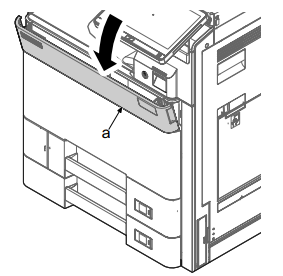
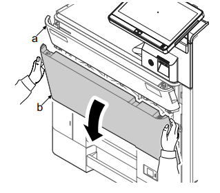
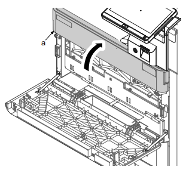
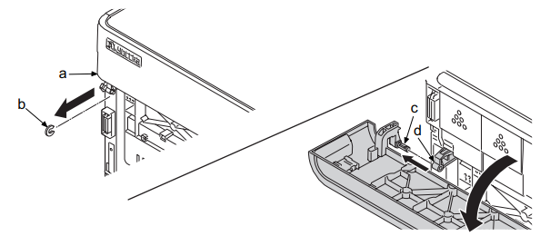

# 4-6 拆卸和组装步骤

## (1) 外部蓋板

### (1-1) 拆卸和安裝前蓋板

1. 略微打开前盖板 （a）。  
  
2. 打开前盖板 （a），然后握住左上和右侧部分同时打开保养用的前盖板 （b）。  
  
3. 关闭前盖板 （a）。  
  
4. 拆下前盖板 （a）的限位器 （b）。  
5. 朝箭头方向滑动前盖板，并从支点轴 （c）拆下支点 （d）。  
    