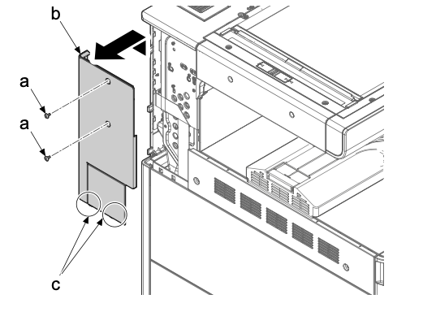
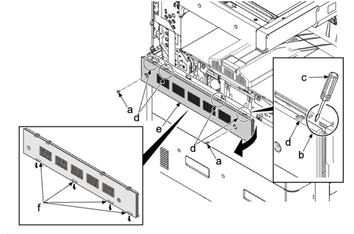
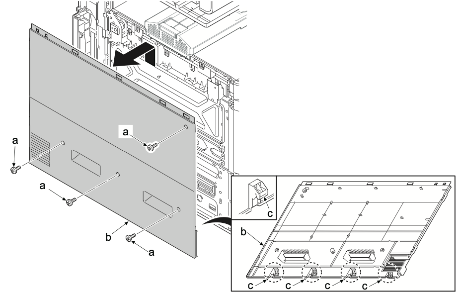

### (1-8)拆卸和安装左上盖板／后左盖板  
1. 拆下两颗螺丝（a）（M3×8）。  
2. 松开两个卡钩（c），沿箭头方向拆下左后盖板（b）。  
  
3. 打开前盖板 。  
4. 拆下两颗螺丝（a）(M3x8) 。  
5. 插入平头螺丝刀（c）至开口的前侧，沿箭头方向拨动开口，拆下四个卡钩（d）并拆下左上盖板（e） 。   
  
### **安装注意事项**  
锁定四个下部卡钩（f）和上部卡钩（d），然后安装左上盖板（e）。  
6. 拉出下部纸盒 。  
7. 拆下四颗螺丝（a）（M3×8）。  
8. 提起并拆下四个卡钩（c）并拆下左下盖板（b）。  
  