## (2)  光学部  
### (2-1) 拆卸和安装 LSU  
1. 打开主机（b）的右盖板（a）。  
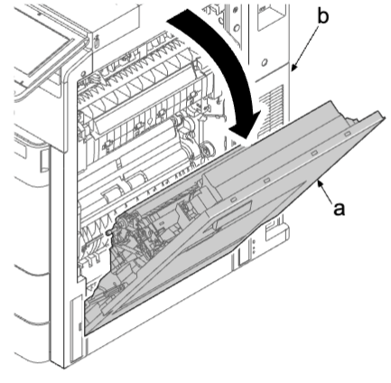   
2. 拆下限位器（a），滑动皮带（b），并将其从销钉（b）上拆下 。  
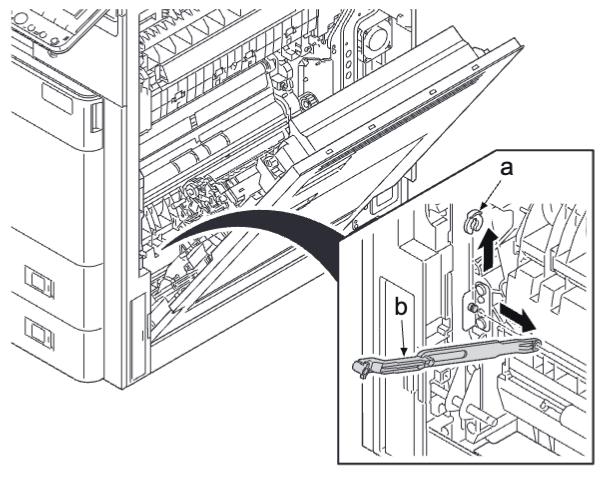  
3. 略微打开前盖板（a）。  
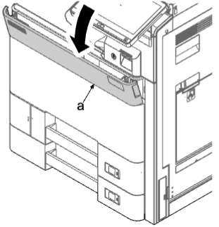   
4. 打开前盖板（a），然后握住左上和右侧部分同时打开保养用的前盖板（b）。  
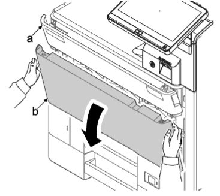  
5. 拉动盖板上的左和右杆（b），打开内部盖板（a）。  
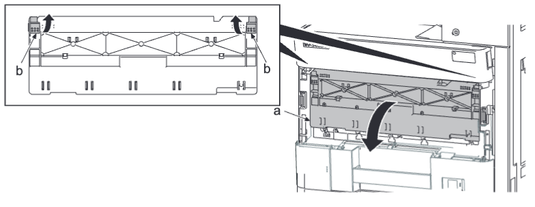  
6. 握住把手拉出对位清洁器（a）。  
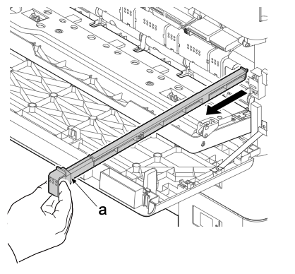  
7. 拆下螺丝（a）（M3×8）。  
8. 沿箭头方向拆下后部次级转印导板（b）。  
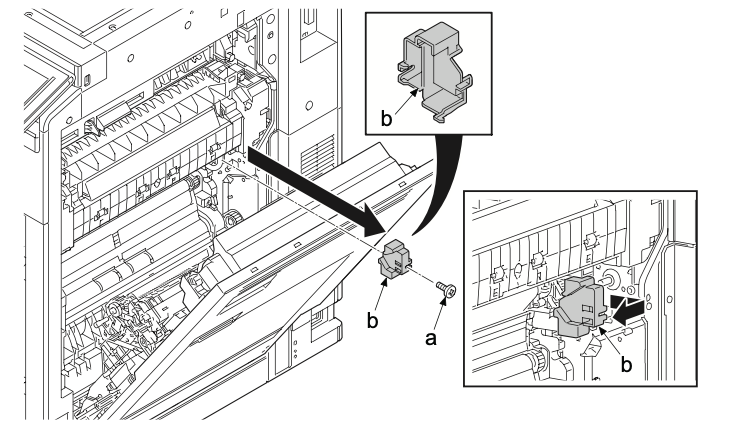  
9. 从接插件（b）拆下中间传输单元线束（a）。  
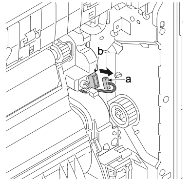  
### **安装注意事项**  
重新安装时，先连接中间传输单元线束（a），然后插入肋片（b）。  
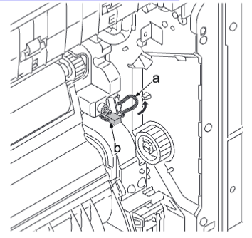  
10. 拆下四颗螺丝（a）（M3×8）并拆下中间传输单元（b）。  
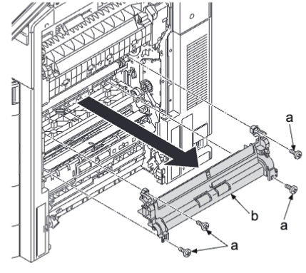  
### **安装注意事项**  
安装中间传输单元（c）时，使定位部件（a）至（d）对准定位孔（b）至（e） 。  
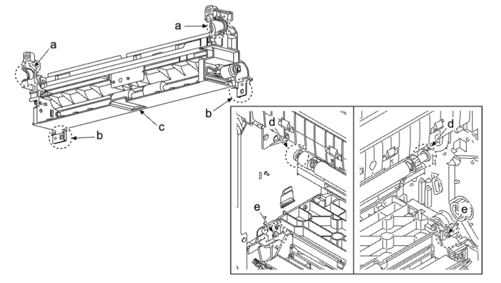  
11. 使用螺丝刀（a）松开 LSU 固定销（c）或弹簧（c）并拆下它们 。  
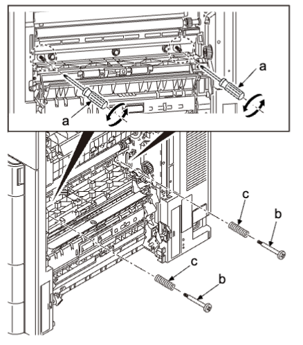  
12. 拆下两颗螺丝（a）（M3×8）。    
13. 松开两个卡钩（c），沿箭头方向拆下左后盖板（b）。    
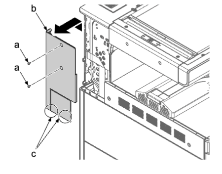   
14. 打开前盖板。     
15. 拆下两颗螺丝（a）（M3×8）。    
16. 插入平头螺丝刀（c）至开口的前侧，沿箭头方向拨动以拆下四个卡钩（d）并拆下左上盖板（e）。  
     
### **安装注意事项**    
先后锁定四个下部卡钩（f）和上部卡钩（d）后安装左上盖板（e）。    
17. 拉出下部纸盒 。  
18. 拆下四颗螺丝（a）（M3×8）。  
19. 提起并拆下四个卡钩（c）并拆下左下盖板（b）。  
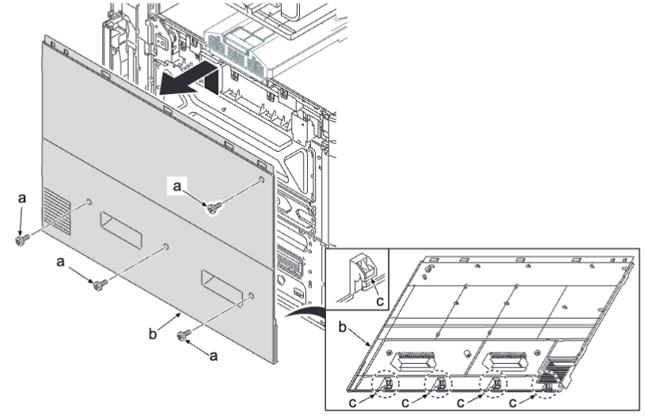     
20. 拆下四颗螺丝（a）（M3×8）并拆下 LSU 左侧支杆（b）。  
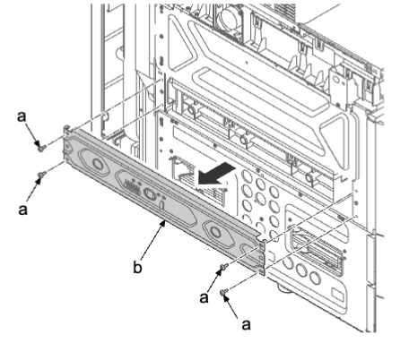     
21. 将激光扫描仪单元（a）拉出一半 。  
•（低端型号）断开 FFC 接插件（b）和接插件（c）。  
•（高端型号）断开两个 FFC 接插件（b）和接插件（c）。  
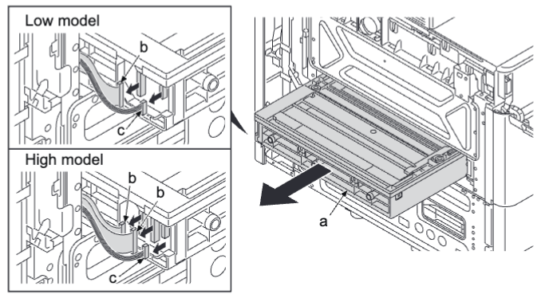  
22. 拉出激光扫描仪单元（a）。  
23. 检查激光扫描仪单元（a），然后清洁或更换 。  
24. 重新将部件安装到原来位置 。  
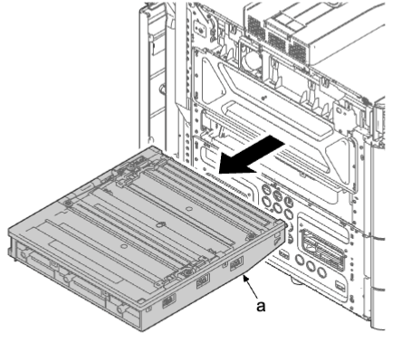  
### **更换激光扫描仪单元的注意事项**   
更换激光扫描仪单元后执行以下调节 。  
## 1
### **检查和调节 LSU 单元**。  
1. 执行保养模式 U034（纸张时序数据调节）。
2. 选择 [开始位置] 或 [中心线] 。  
•显示用于调节的画面 。  
3. 按 [系统菜单／计数器] 键 。  
4. 按 [开始] 键输出测试图案 。  
5. 按 [系统菜单／计数器] 键 。  
6. 在输出的测试图案上测量 A 和 B 的两个长度 。  
7. 在测量两个位置 A 和 B 的尺寸时，如果尺寸差为 1.5 mm 或以下，则完成调节 。    
•如果尺寸差大于 1.5 mm，请转至下一步骤 。     
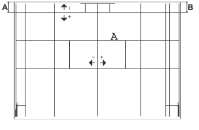      
8. 拧松两颗螺丝（c）。     
9. 使用调节旋钮（a）调节刻度尺（b）作为参照 。    
•如果测量的值 B < A，朝左移动调节旋钮（a） 。  
•如果测量的值 A < B，朝右移动调节旋钮（a） 。  
10.  紧固两颗螺丝（c）。    
•重复步骤 3 至 10 。    
     
## 2
### **初级转印单元初始设定：歪斜**  
1. 执行保养模式 U469（初级转印单元初始设定）。  
2. 选择 [手动]。  
3. 选择 [打印]。  
4. 按 [开始] 键输出手动调节图表。  
5. 如果各色彩的 V-1 和 V-5 匹配刻度位置之差为 2 个刻度或以上，请执行以下调节 。  
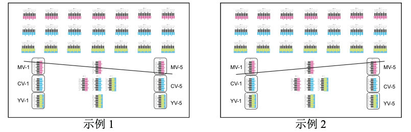
1. 略微打开前盖板并打开保养用的前盖板 。  
2. 使用六角扳手（5 mm）旋转六角孔（a）。  
• 旋转方向  
  V-1 和 V-5 匹配刻度之差为 2 个刻度或以上（样本 1）：逆时针V-1 和 V-5 匹配刻度之差为 -2 个刻度或以上（样本 2）：顺时针  
• 旋转次数  
  V-1 和 V-5 匹配刻度之差乘以 4 。  
1. 关闭内部盖板和保养用的前盖板 。  
2. 输出调节图表并检查其是否在范围之内 。  
3.  按 [停止] 键 。  
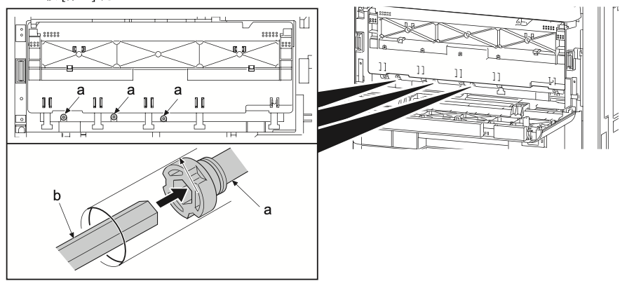  
## 3
### **初级转印单元初始设定（保养模式 U469）：自动**  
1. 使用数字键输入“469”，并按 [开始] 键 。  
2. 选择 [自动] 。  
•输出自动调节图表 。  
1. 选择 [执行] 。  
2. 在稿台上放置图表并按 [开始] 键 。  
•执行自动调节。调节完成而未发生错误时，显示 [OK] 。  
1. 按 [停止] 键 。  
## 4
### **感光鼓单元初始设定（保养模式 U119）：执行（仅高端型号）**  
1. 使用数字键输入“119”，并按 [开始] 键 。  
2. 选择 [执行] 并按 [开始] 键 。  
•开始感光鼓设置操作 。  
1. 按 [停止] 键 。  
## 5
### **ID校正操作设定（保养模式 U464）：校准**  
1. 使用数字键输入“464”，并按 [开始] 键 。  
2. 选择 [校准] 。  
3. 选择 [执行] 并按 [开始] 键 。  
•开始校准 。  
1. 按 [停止] 键 。  
## 6
### **调节浓度不均匀（保养模式 U412）：正常模式（仅高端型号）**  
1. 使用数字键输入“412”，并按 [开始] 键 。  
2. 选择 [正常模式] 。  
3. 按 [开始] 键 。  
• 使用初始光强度设定输出测试图表。（第一张）  
1. 在测试图表上放置约 20 张白纸并设为原稿 。  
2. 按 [开始] 键 。 开始校正 。  
3. 完成校正后按 [开始] 键 。 输出测试图表。（第二张）  
• 与第一张图表相比，降低 20% 的光强度进行输出 。  
1. 在测试图表上放置约 20 张白纸并设为原稿 。  
2. 按 [开始] 键 。 开始校正 。  
3. 完成校正后按 [开始] 键 。 输出测试图表。（第三张）  
4.  在测试图表上放置约 20 张白纸并设为原稿 。  
5.  按 [开始] 键 。  
• 检查校正结果 。 正常完成校正时，显示 [完成] 。  
1.  按 [停止] 键 。  
## 7
### **ID校正操作设定（保养模式 U464）：校准（仅高端型号）**  
1. 使用数字键输入“464”，并按 [开始] 键 。  
2. 选择 [校准] 。  
3. 选择 [执行] 并按 [开始] 键 。  
• 开始校准 。  
1. 按 [停止] 键 。  
## 8  
### **自动半色调调节（保养模式 U410）**  
1. 使用数字键输入“410” 。  
2. 按 [开始] 键 。  
• 显示执行信息画面 。  
• 在 A4/Letter 纸上输出测试图表 1、2 和 3 。  
1. 在稿台玻璃板上放置测试图表 1，使正面朝下箭头端位于远侧 。  
• 在图表上放置约 20 张白纸 。  
1. 按 [开始] 键 。  
• 执行第一次自动调整 。  
1. 显示 [OK] 后，继续使用图表 2 和 3 重复步骤 2 至 3 。  
2. 正常完成后，显示 [完成] 。  
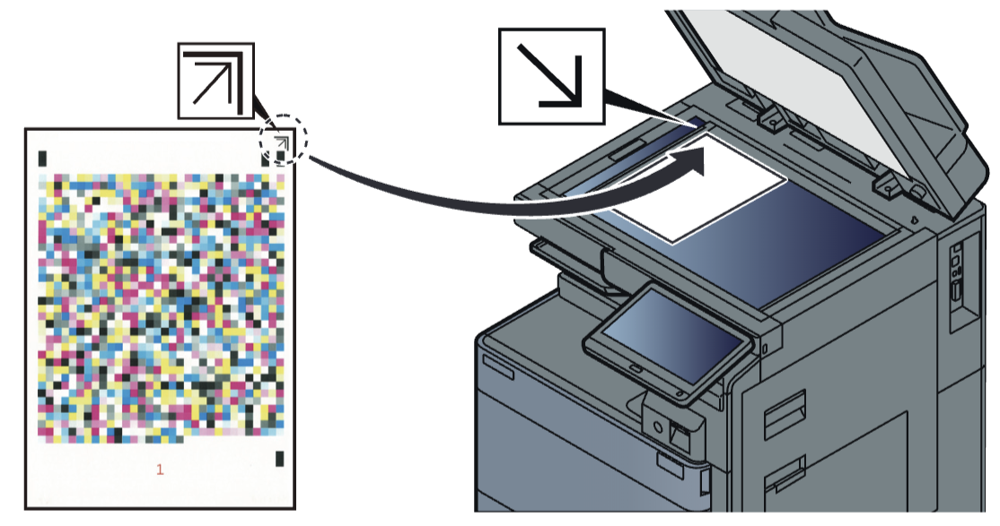  
## 9
1. 退出保养模式 。  
2. 使用数字键输入“001”，并按 [开始] 键 。  
• 退出保养模式 。  