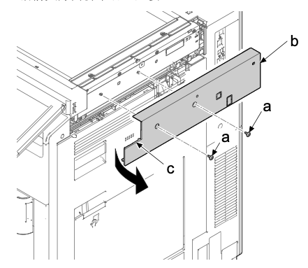
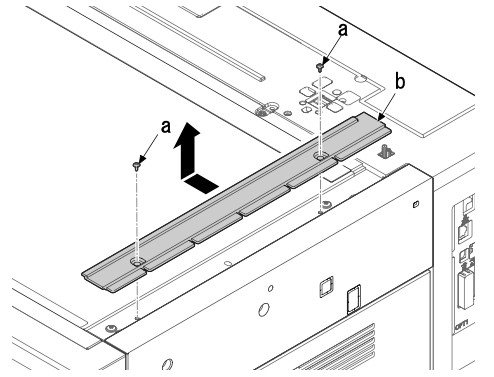
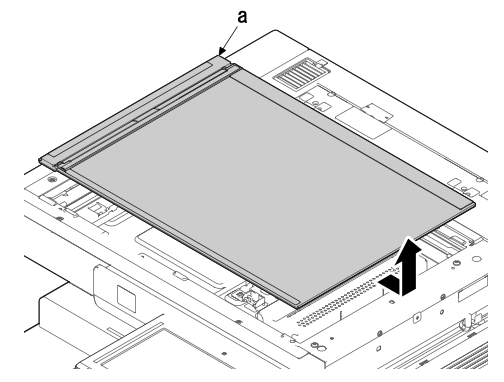
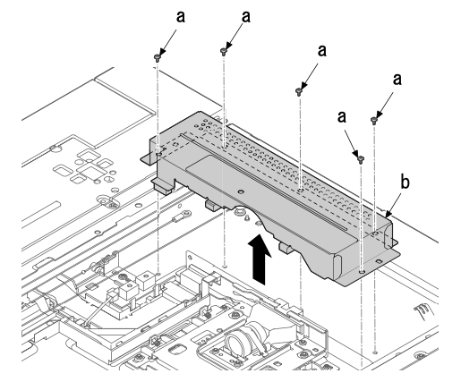
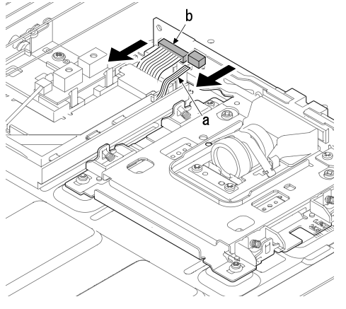
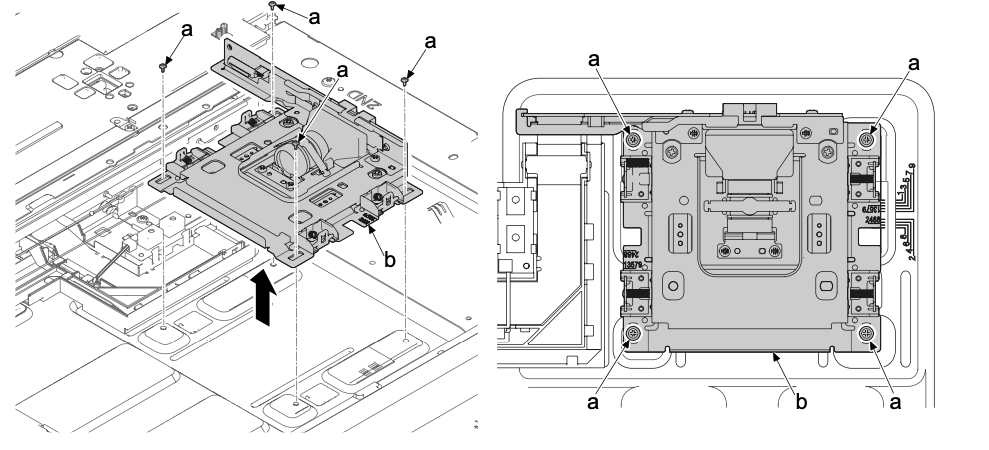
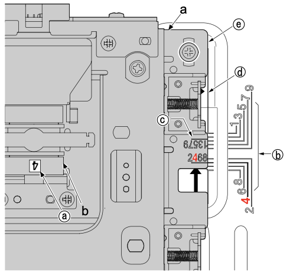

### (2-2)拆卸和安装透镜单元  
1. 拆下两颗螺丝（a）（M3×8）。  
2. 拆下前部肋片（c）后，沿箭头方向拆下右上盖板（b）。  
  
3. 拆下两颗螺丝（a）（M3×8）并拆下右 ISU 盖板（b）。  
  
4. 沿箭头方向拆下稿台玻璃（a）。  
  
5. 拆下五颗螺丝（a）（M3×8）并拆下透镜盖板（b）。  
  
6. 拆下 FFC（a）。  
7. 从 FFC 接插件（b）拆下 FFC。  
  
8. 拆下四颗螺丝（a）（M3×8）。  
9. 沿箭头方向拆下透镜单元（b）。  
  
### **安装透镜单元**  
按如下固定透镜单元（a）的位置 。  
机器的右侧和左侧：确认透镜（b）上粘贴标签上的数字 。 匹配线条编号和标签上的数字 。  
机器的后侧和前侧：对齐透镜单元（a）的边缘（e）和框架侧的定位线（d） 。  
 
 
用四颗螺丝将透镜单元（a）固定到原来位置 。  
  