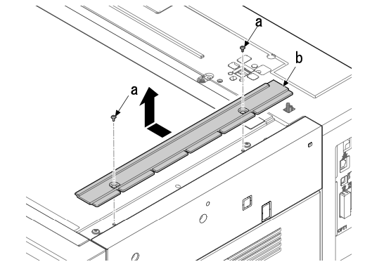
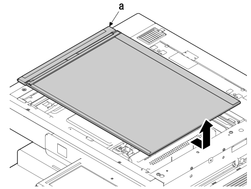
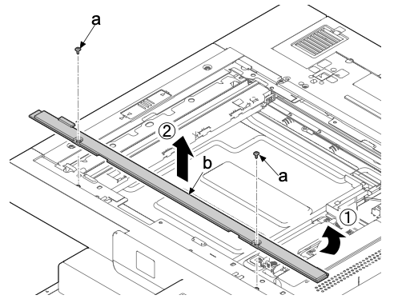
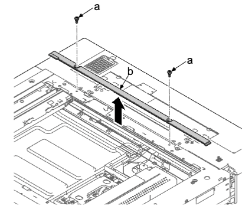
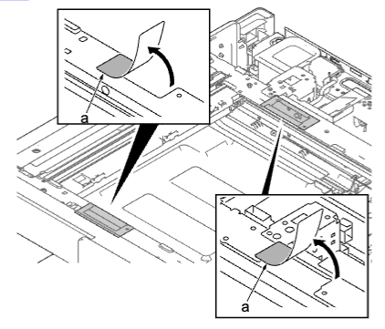
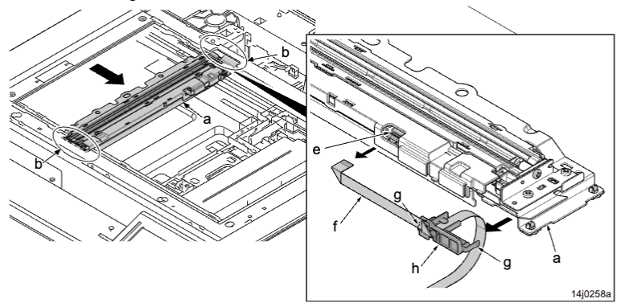
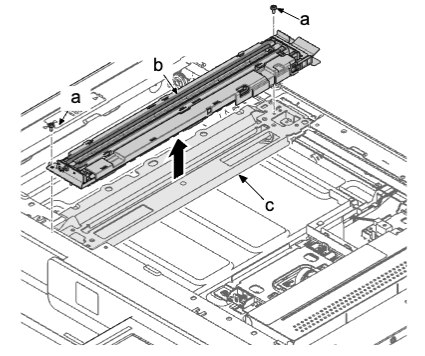

### (2-3)拆卸和安装灯单元  
1. 拆下原稿盖板或送稿器 。  
2. 拆下两颗螺丝（a）（M3×8），并沿箭头方向拆下右 ISU 盖板（b） 。  
  
3. 沿箭头方向拆下稿台玻璃（a） 。  
  
4. 拆下两颗螺丝（a）（M3×8），然后拆下前稿台盖板（b） 。  
*：先拆机器的右侧，然后将其拆下 。  
  
5. 拆下两颗销钉（a）（M3×8），然后拆下后稿台盖板（b）。  
  
6. 撕下两个保护片（a）。  
  
7. 将灯单元组件（a）移至开口（b）。  
8. 从 FFC 接插件（e）拆下 FFC（f）。  
9. 拆下两个卡钩（g）并从曝光灯单元（a）拆下 FFC 导板（h）。  

10. 拆下两颗螺丝（a）（M3×8）并从反光镜架 A（c）拆下曝光灯单元（b）。  
11. 检查或更换曝光灯单元（b），然后在原来位置重新安装部件 。  
12. 更换曝光灯单元（b）时，请执行保养模式 U411（自动调节扫描仪）。  
  