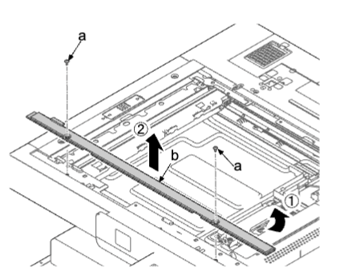
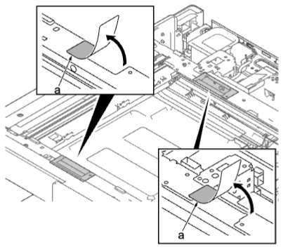
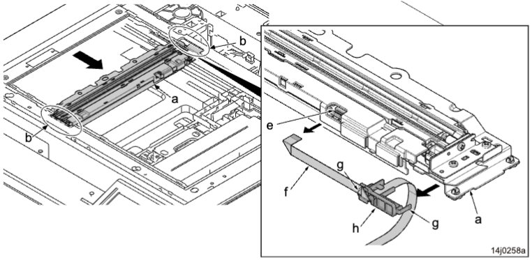
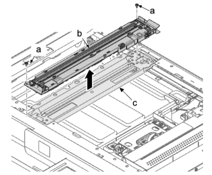
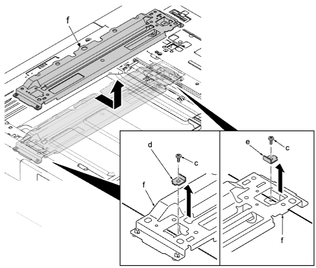
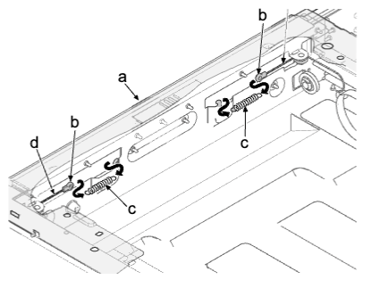
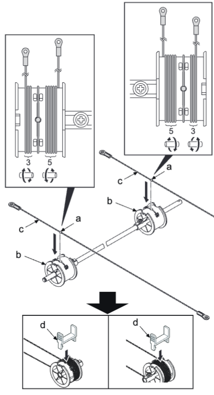
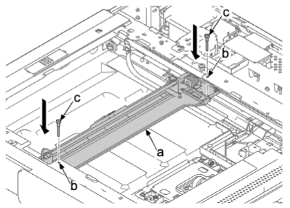
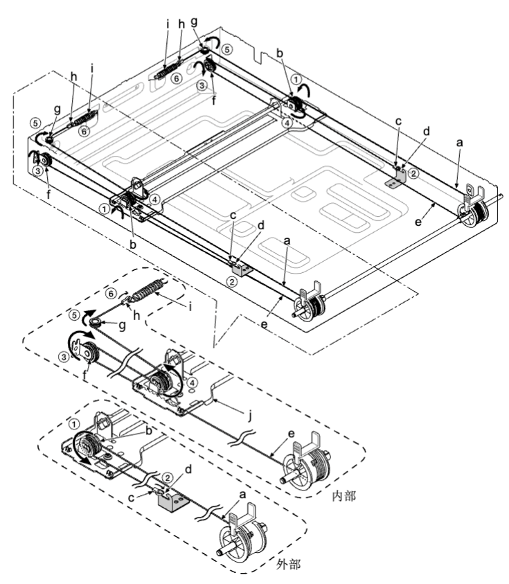
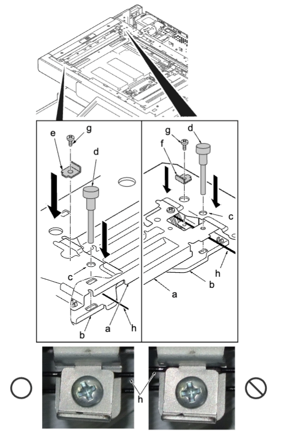

### (2-4)拆卸和安装扫描仪钢丝
### 注意事项
安装扫描仪钢丝时，请务必使用以下指定的部件 。  
•机器前部（P/N：302H717380（灰色））    
•机器后部（P/N：302H717390（黑色））  
### 安装钢丝的工具  
•两个框架固定工具（P/N：302NL1711*）  
•两个扫描仪钢丝限位器（P/N：302RH9401*）  
1. 拆下右上盖板 。  
2. 拆下 ISU 右盖板 。  
3. 拆下稿台玻璃 。  
4. 拆下两颗螺丝（a）（M3×8），然后拆下前稿台盖板（b） 。  
• 先拆机器的右侧，然后将其拆下 。  
  
5. 拆下两颗销钉（a）（M3×8），然后拆下后稿台盖板（b）。  
6. 撕下两个保护片（a）。  
  
7. 将灯单元组件（a）移至开口（b）。  
8. 从 FFC 接插件（e）拆下 FFC（f）。  
9. 拆下两个卡钩（g）并从曝光灯单元（a）拆下 FFC 导板（h）。  
  
10. 拆下两颗螺丝（a）（M3×8） 並從反光鏡架 A（c）拆下曝光燈單元（b）。  
  
11. 從反光鏡架 A（f）拆下各一顆螺絲（c）（M3×8）、前線束壓板（d）和後線束壓板（e）。  
12. 从主机拆下反光镜架 A（f）。  
  
13. 從掃描儀鋼絲彈簧（c）拆下掃描儀單元（a）左側的圓形端子。  
14. 從主機拆下掃描儀鋼絲（d）。    
  
### **安装扫描仪钢丝**  
1. 將掃描儀鋼絲上的小鋼珠（a）插入掃描儀鋼絲卷筒（b）的孔中。  
2. 將掃描儀鋼絲（c）向內繞三圈，向外繞五圈。  
   • 將短掃描儀鋼絲的小滾珠卷繞至外面。  
   • 在機器前側使用灰色鋼絲，在機器後側使用黑色鋼絲。  
3. 使用掃描儀鋼絲限位器（d）來固定掃描儀鋼絲（c）。  
  
1. 如圖所示，將反光鏡架 B（a）移動到指定位置，並將兩個框架固定工具（c）插入機器中心的前後定位孔（b），以固定反光鏡架 B（a）到位。  
  
### **安装钢丝**    
1. 從下至上，將外部掃描儀鋼絲（a）繞在反光鏡架 B 上滑輪（b）的外槽中。  
   • 確保掃描儀鋼絲穿過定位銷的外部。  
2. 將圓形端子（c）掛在掃描儀單元內的抓鉤（d）上。  
3. 從下至上，將內部掃描儀鋼絲（e）繞在掃描儀單元左側滑輪（f）的凹槽中。  
   • 確保掃描儀鋼絲穿過反光鏡架 B（j）的下側。  
4. 從下至上，將掃描儀鋼絲繞在反光鏡架 B 上滑輪（b）的內部凹槽中。  
5. 沿滑輪（g）繞鋼絲。  
6. 將圓形端子（h）掛在掃描儀鋼絲彈簧（i）上。  
7. 對另一條掃描儀鋼絲重複執行步驟 1 至 6。  
 
1. 拆下掃描儀鋼絲限位器和反光鏡架固定工具（a）。  
2. 沿鋼絲卷筒中的小滾珠，將掃描儀鋼絲與內部對齊（b）。  
3.  來回移動反光鏡架 B（c），確保鋼絲可順暢移動。  
4.  重新在主機上安裝反光鏡架 A（d）。  
5.  移動反光鏡架 A（d）和反光鏡架 B（c）至機器左側，並將兩個框架固定工具（e）插入至掃描儀單元的前後定位孔（f），以固定反光鏡架 A（d）和反光鏡架 B（c）到位。  
6.  將前鋼絲固定板（g）和後鋼絲固定板（h）安裝至反光鏡架 A（d）。  
7.  拆下框架固定工具（e）。  
8.  重新將曝光燈單元安裝到原來位置（i）。  
   