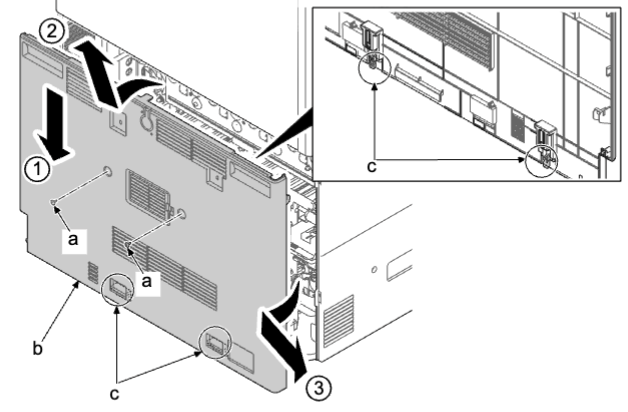
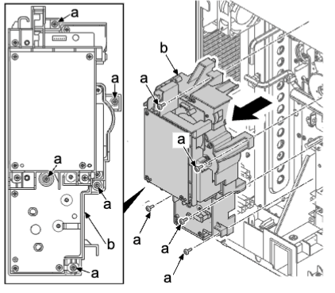

## (3)驱动部  
### (3-1) 拆卸和安装 PF 驱动单元  
1. 拆下螺丝（a）（M3×8）。  
2. 向下按后部下盖板（b），松开上部肋片，提起盖板以松开下部卡钩（c）。然后，沿箭头方向将其拆下。  
   
1. 从供纸驱动电路板（a）拆下 10 个接插件（b）。  
2. 松开线束夹（c），并拆下线束（d）。  
   
1. 拆下五颗螺丝（a）（M3×8）并拆下供纸驱动单元（b） 。  
2. 检查驱动单元（b），然后清洁或更换 。  
3. 重新将部件安装到原来位置 。  
  