### (3-2)拆卸和安装主驱动单元    
### 低端型号  
1. 拆下螺丝（a）（M3×10），然后朝箭头方向滑动来拆下后部上盖板（b）。  
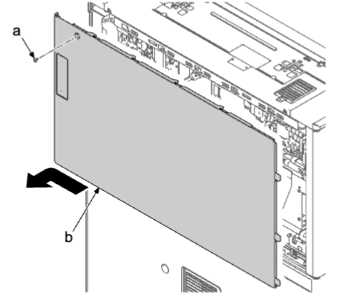  
1. 拆下螺丝（a）（M3×8）。  
2. 向下按后部下盖板（b），松开上部肋片，提起盖板以松开下部卡钩（c）。然后，沿箭头方向将其拆下。  
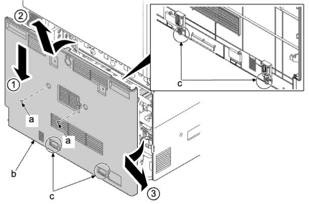  
1. 从供纸驱动电路板（a）拆下 3 个接插件（b）。  
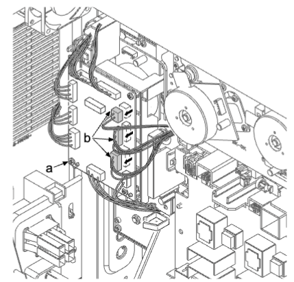  
1. 松开 4 个线束夹（a）。通过卡扣（b）松开电缆扎带并拆下线束（c）。  
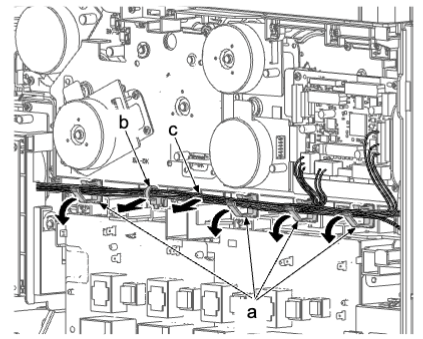  
1. 从供纸驱动电路板（a）拆下 16 个接插件（b）。  
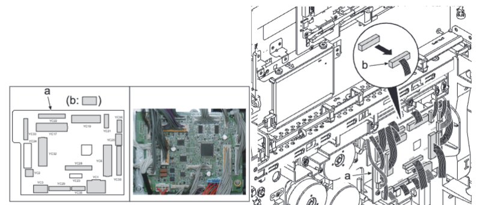  
1. 通过卡扣（b）松开电缆扎带并拆下线束（c）。  
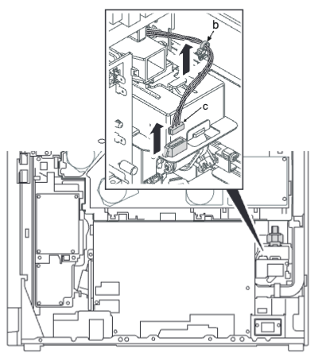   
1. 将线束（a）勾在卡钩（b）上 。  
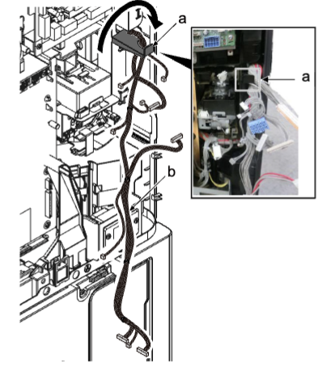   
**重要**  
除非拆下驱动单元而不将线束（b）勾在卡钩（a）上，否则废粉接头中的传感器清洁弹簧可能会因线束和废粉接头干扰而导致功能异常。这会导致废粉检测错误或堵塞 。  
1.  向上推废粉接头（a）的卡钩（b）以松开限位器（c）并将其拉出 。  
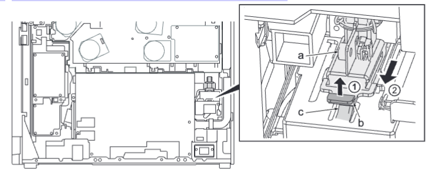   
**重要**  
除非拆下驱动单元而不拆下废粉接头（a），否则废粉接头中的传感器清洁弹簧可能会功能异常。这会导致废粉检
测错误 。  
移开主驱动单元前必须松开废粉接头 。  
1.  拆下六颗螺丝（a）（M3×8）并拆下主驱动单元（b）。  
   
### 拆下废粉传输单元  
1.   拆下三颗螺丝（a）（M3×8）。  
2.   松开 4 个卡钩（b）并移开废粉传输单元（c）。  
3.   检查废粉传输单元（c），然后清洁或更换 。  
4.   检查主驱动单元（d），然后清洁或更换 。  
5.   重新将部件安装到原来位置 。  
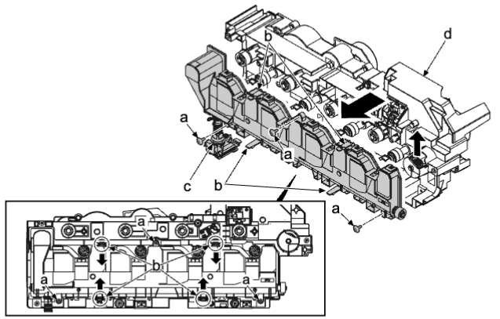   
### 高端型号  
1. 拆下螺丝（a）（M3×10），然后朝箭头方向滑动来拆下后部上盖板（b）。  
   
2. 拆下螺丝（a）（M3×8）。  
3. 向下按后部下盖板（b），松开上部肋片，提起到略打开的状态并松开下部卡钩（c）。然后，沿箭头方向将其拆下。  
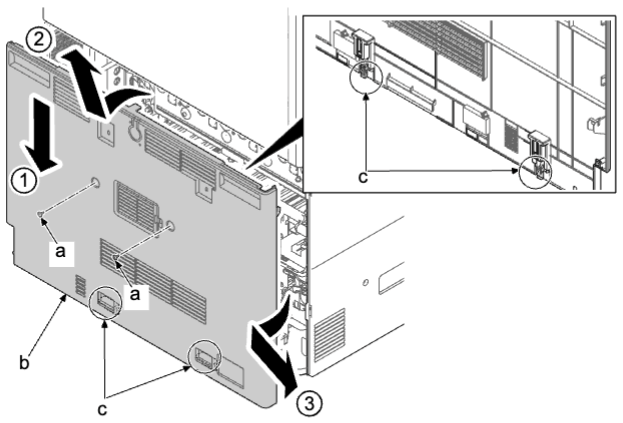   
4. 从供纸驱动电路板（a）拆下 3 个接插件（b）。  
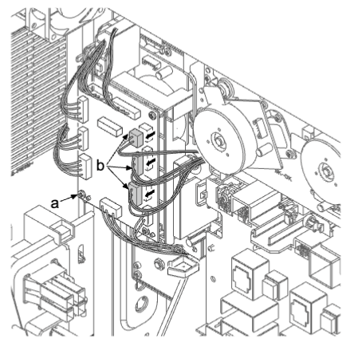   
5. 断开两个接插件（d）。松开四个线束夹（a）。通过卡扣（b）松开电缆扎带并拆下线束（c）。  
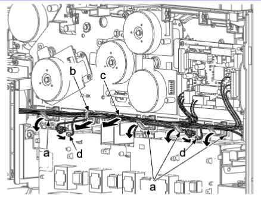   
6. 从供纸驱动电路板（a）拆下 16 个接插件（b）。 
 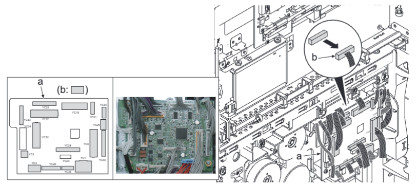   
7. 通过卡扣（b）松开电缆扎带并拆下线束（c）。  
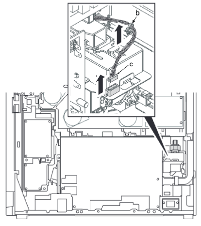   
8. 将线束（a）勾在卡钩（b）上 。  
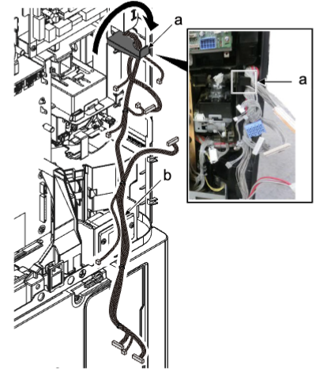   
**重要**  
除非拆下驱动单元而不将线束（b）勾在卡钩（a）上，否则废粉接头中的传感器清洁弹簧可能会因线束和废粉接头干扰而导致功能异常。这会导致废粉检测错误或堵塞 。  
9.  向上推废粉接头（a）的卡钩（b）以松开限位器（c）并朝自身将其拉出 。  
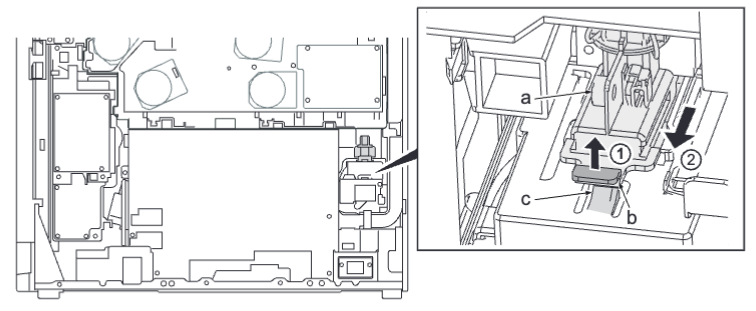   
**重要**  
除非拆下驱动单元而不拆下废粉接头（a），否则废粉接头中的传感器清洁弹簧可能会功能异常。这会导致废粉检测错误 。  
移开主驱动单元前必须松开废粉接头 。  
10. 拆下六颗螺丝（a）（M3×8）并拆下主驱动单元（b）。  
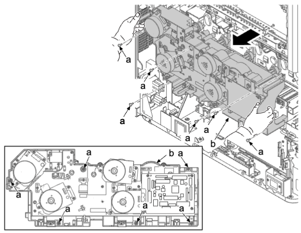   
### 拆下废粉传输单元
1.  松开 4 个卡钩（b）并移开废粉传输单元（c）。  
2.  检查废粉传输单元（c），然后清洁或更换。  
3.  检查主驱动单元（d），然后清洁或更换。  
4.  重新将部件安装到原来位置 。  