### (3-4)拆卸和安装墨粉供应驱动单元   
1. 拆下螺丝（a）（M3×10），然后朝箭头方向滑动来拆下后部上盖板（b）。  
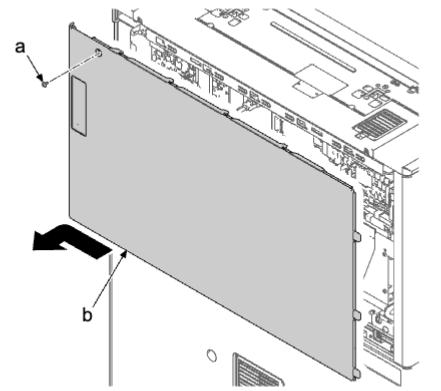   
2. 拆下两颗螺丝（a）（M3×10）。  
3. 向下按后部下盖板（b），松开上部肋片，提起到略打开的状态并松开下部卡钩（c）。然后，沿箭头方向将其拆下。  
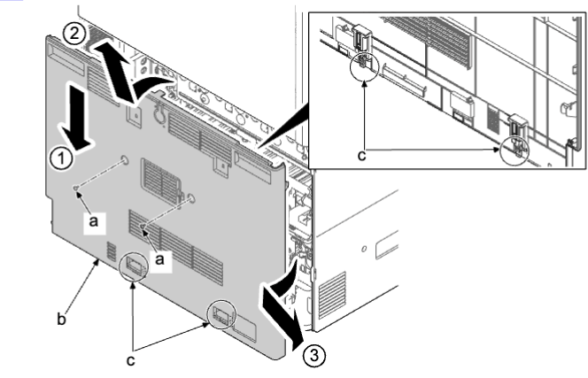   
4. 如果安装了送稿器，将其打开。  
5. 拆下两颗螺丝（a）（M3×8）。  
6. 沿箭头方向拆下送稿器后盖板（b）。  
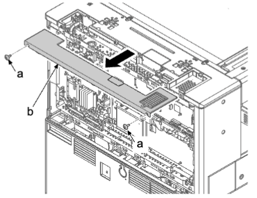   
7. 拆下两颗螺丝（a）（M3×8）。  
8. 松开两个卡钩（c），沿箭头方向拆下左后盖板（b）。  
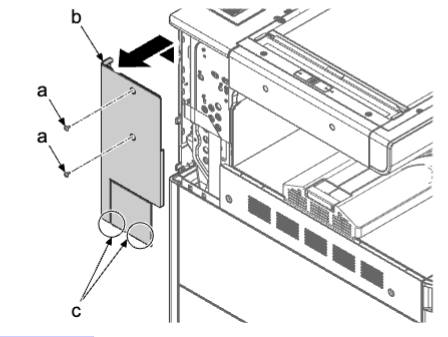   
9. 打开主机（b）的右盖板（a）。  
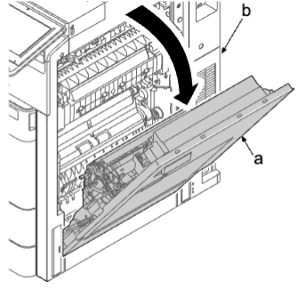   
10. 拆下两颗螺丝（a）（M3×8）。  
11. 松开卡钩（b）并拆下右侧后上盖板（c）。  
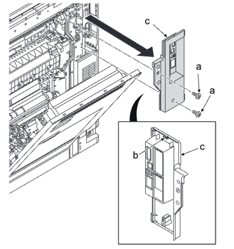   
12. 从主电路板（a）松开四个接插件（b）并从开口（e）取出。从两个线束夹（d）拆下线束（c）。  
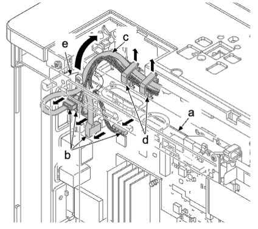   
13. 从引擎电路板断开 FFC 和接插件。  
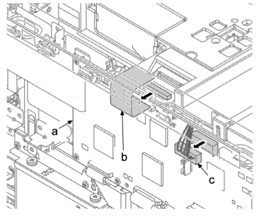   
14. 拆下三颗螺丝（a）（M3×8）。  
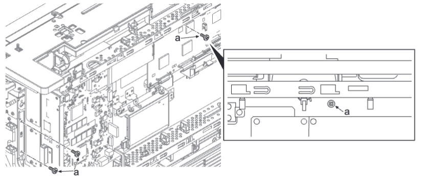   
15. 提起并拉动护罩盒（a），然后松开卡钩（b）。  
16. 打开护罩盒（a）。  
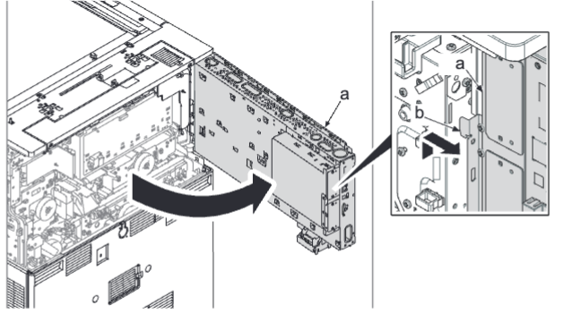   
**注意**  
如果在打开护罩盒的情况下在机器的后下侧进行操作，注意防止头部触碰护罩盒。  
17. 从墨粉盒电机（a）拆下接插件（b）。从供纸图像电路板（c）拆下 10 个接插件（d）。  
18. 从五个线束夹（f）拆下线束（e）。  
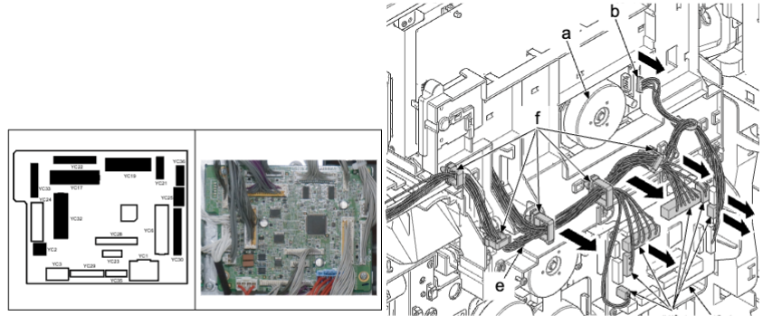   
19. 拆下两颗螺丝（a）（M3×8）。  
20. 使用平头螺丝刀（b）依次松开六个上侧卡钩（c）和四个下侧卡钩（c），然后拆下转印端子盖板（d）。  
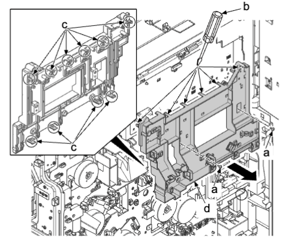   
**重要**  
安装转印端子盖板（a）时，确保肋片（b）处于两个端子之间。（八个位置）  
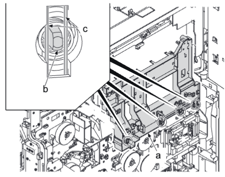   
21.  从供纸驱动电路板（a）拆下三个接插件（b）。  
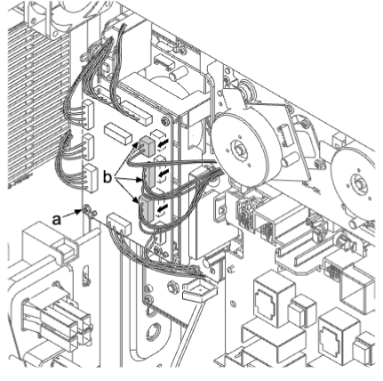   
22. 断开两个接插件（d）。松开四个线束夹（a）。通过卡扣（b）松开电缆扎带并拆下线束（c）。  
   
23. 从供纸驱动电路板（a）拆下 16 个接插件（b）。  
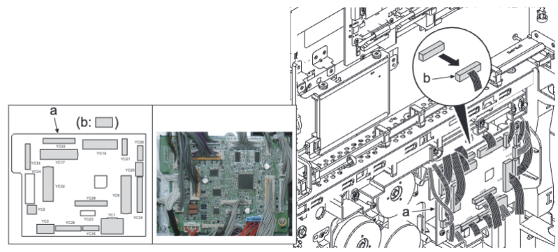   
24. 通过卡扣（b）松开电缆扎带并拆下线束（c）。  
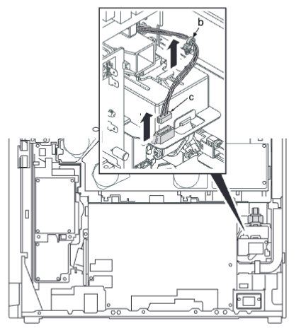   
25. 将线束（a）勾在卡钩（b）上。  
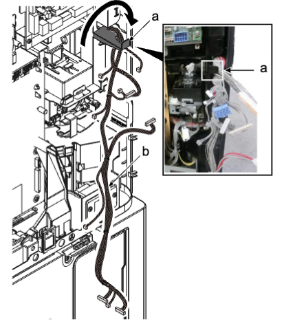   
**重要**  
除非拆下驱动单元而不将线束（b）勾在卡钩（a）上，否则废粉接头中的传感器清洁弹簧可能会因线束和废粉接头干扰而导致功能异常。这会导致废粉检测错误或堵塞。  
26. 向上推废粉接头（a）的卡钩（b）以松开限位器（c）并将其拉出。  
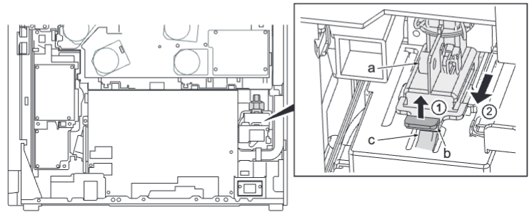   
**重要**  
除非拆下驱动单元而不拆下废粉接头（a），否则废粉接头中的传感器清洁弹簧可能会功能异常。这会导致废粉检测错误。  
移开主驱动单元前必须松开废粉接头。  
27.  拆下六颗螺丝（a）（M3×8）并拆下主驱动单元（b）。
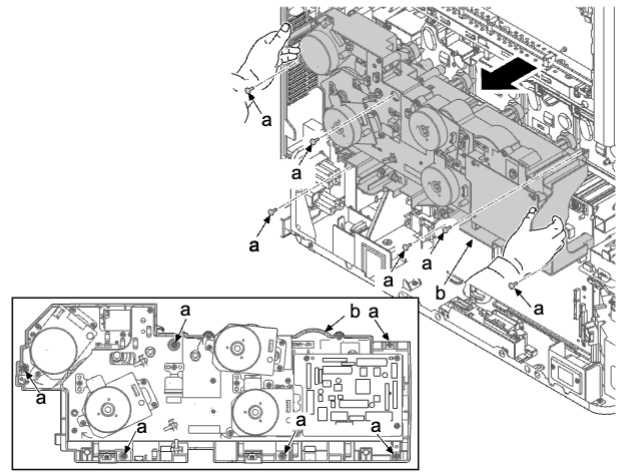     
28. 展宽各两个卡钩（a）并松开卡钩（b），然后拉出墨粉供应驱动单元的接头（c）以将其拆下 。  
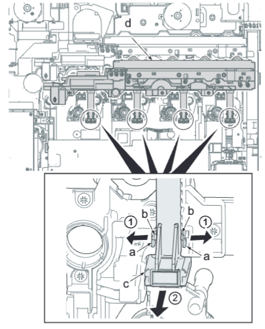     
29. 拆下三颗螺丝（a）（M3×8）并拆下墨粉供应驱动单元（b）。  
30. 检查墨粉供应驱动单元（b），然后清洁或更换 。  
31. 重新将部件安装到原来位置。  
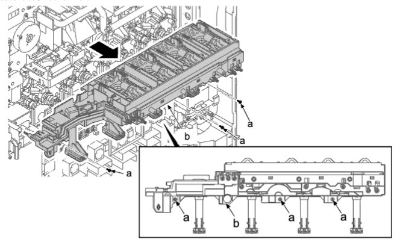     