### (3-5) 拆卸和安装定影驱动单元  
1. 拆下螺丝（a）（M3×10），然后朝箭头方向滑动来拆下后部上盖板（b）。  
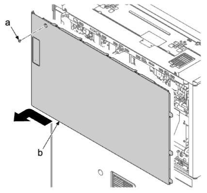     
2. 拆下两颗螺丝（a）（M3×10）。  
3. 向下按后部下盖板（b），松开上部肋片，提起到略打开的状态并松开下部卡钩（c）。然后，沿箭头方向将其拆下 。  
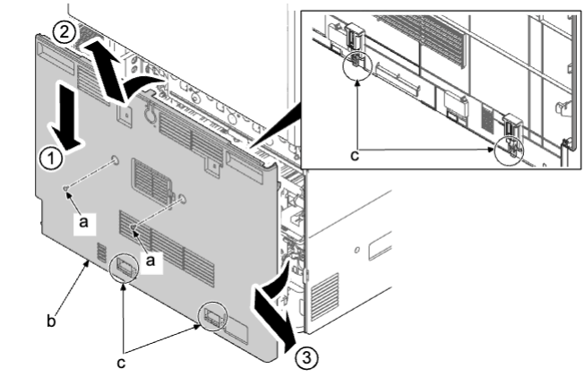     
4. 如果安装了送稿器，将其打开 。  
5. 拆下两颗螺丝（a）（M3×8）。  
6. 沿箭头方向拆下送稿器后盖板（b）。  
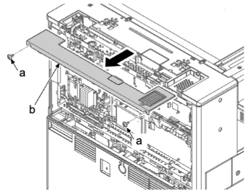     
7. 拆下两颗螺丝（a）（M3×8）。  
8. 松开两个卡钩（c），沿箭头方向拆下左后盖板（b）。  
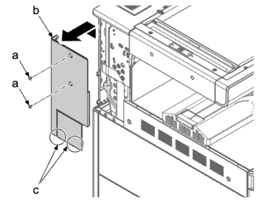     
9. 打开主机（b）的右盖板（a）。  
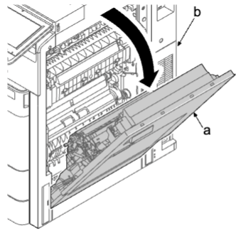     
10. 拆下两颗螺丝（a）（M3×8）。  
11. 松开卡钩（b）并拆下右侧后上盖板（c）。  
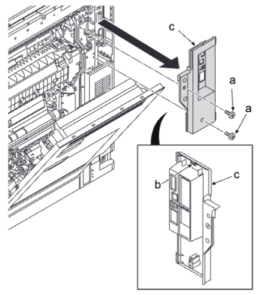  
12. 从主电路板（a）松开四个接插件（b）并从开口（e）取出。从两个线束夹（d）拆下线束（c）。  
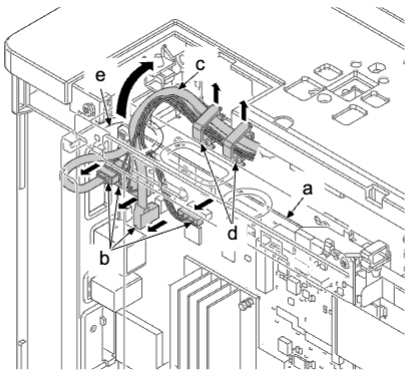  
13. 从引擎电路板（a）断开 FFC（b）和接插件（c）。  
  
14. 拆下三颗螺丝（a）（M3×8）。  
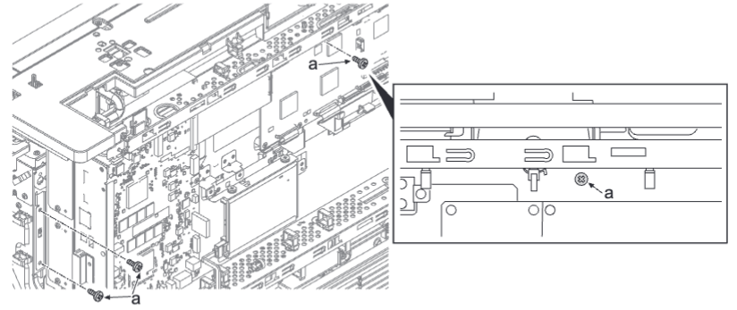  
15. 提起并拉动护罩盒（a），然后松开卡钩（b）。  
16. 打开护罩盒（a）。  
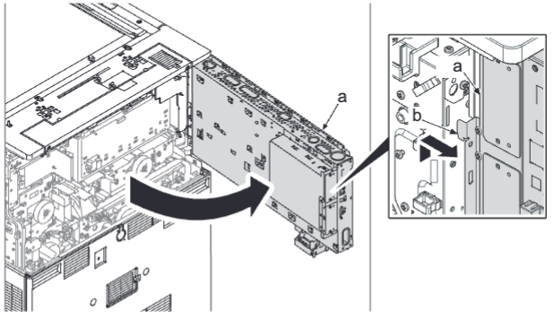  
**注意**  
如果在打开护罩盒的情况下在机器的后下侧进行操作，注意防止头部触碰护罩盒。  
17. 拆下定影单元 。  
18. 从卡钩（c）拆下两个接插件（a）和线束（b）。  
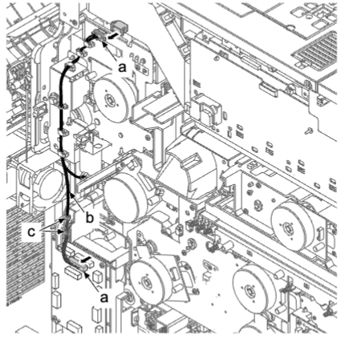  
19. 拆下四颗螺丝（a）（M3×8）。  
20. 在按释放杆（b）的同时，沿箭头方向拆下定影驱动单元（c）。  
21. 检查定影驱动单元（c），然后清洁或更换 。  
22. 重新将部件安装到原来位置 。  
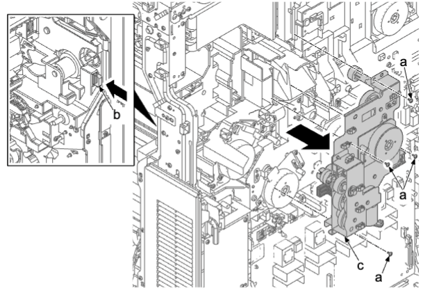  
### 安装注意事项  
重新安装定影驱动单元（a）时，沿箭头方向拉动杆（b）并使对侧杆（c）穿过开口（d）。  
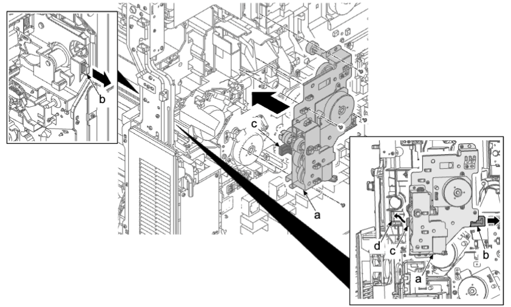  