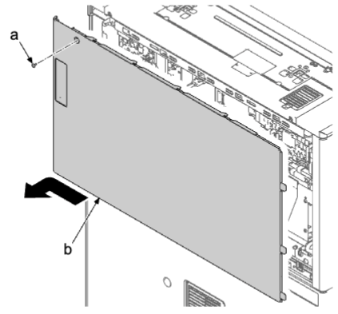
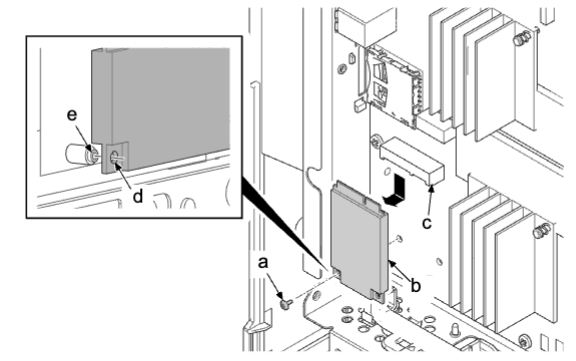

## (4)其他  
### (4-1)拆卸和安装固态硬盘  
1. 拆下螺丝（a）（M3×10），然后朝箭头方向滑动来拆下后部上盖板（b）。  
  
2. 拆下螺丝（a）（M2×4）。  
3. 从接插件（c）上拆下固态硬盘（b）。  
•使用十字头 1 号螺丝刀并注意以免损坏螺丝 。  
•此螺丝为专用螺丝。不要固定除下面以外的部件 。  
（7BB000204H BIND M SCREW 2×4）  
  
**重要**  
为在安装固态硬盘（b）时避免发生损坏，请对齐螺丝孔（d）和定位凸台（e）。  
请勿同时更换主电路板、引擎电路板和固态硬盘 。  
### 指示更换固态硬盘时的固态硬盘更换步骤。  
当固态硬盘损坏或处于只读模式中时，由于无法读取数据，无法通过 U026 进行数据转移。  
准备工作：2 个 USB 驱动器（用于固件和数据备份）。  
开始前在 U917 中运行数据备份。  
## 1  
### 驱动器中的固件存储（USB 驱动器 A）  
1. 存储最新的固件升级包或发行固件组件（主／MMI／面板／浏览器／字典／语言／色表）。   
•检查固件是否适用于目标机型。使用不正确的固件会导致固件安装不稳定。  
启动至少需要一个主固件。  
## 2  
### 固态硬盘数据备份（USB 驱动器 B）
•进行 32 GB 固态硬盘完全备份需要 64 GB USB 驱动器。
1. 安装 USB 驱动器 B 。  
2. 执行保养模式 U026  
使用数字键输入“026”，并按 [开始] 键 。  
选择 [SSE] 。  
选择 [备份]。按 [开始] 键 。  
完成后关闭电源 。  
3. 更换新的固态硬盘 。  
•注意，安装不符合规格的固态硬盘（8G/32G）会导致 F010 固态硬盘通信错误 。  
4. 安装 USB 驱动器 A 时关闭电源 。   
由于无法从固态硬盘加载程序，主电路板上的固态硬盘恢复程序 SNOR 会启 动，因而会自动执行固态硬盘格式  
化 。  
•注意，无 USB 驱动器会导致 F010 错误 。  
5. 如果控制面板上显示更新完成，请在插入 USB 驱动器 A 的情况下关闭电源，然后再打开 。  
## 3   
### 更新固件。（参阅第 5-1 页）  
## 4  
### 检索 USB 驱动器 B 中备份的数据 。  
## 5  
### 在应用程序画面上从 HyPAS 应用程序安装 。  
•更换前，确认应用程序画面上显示的 HyPAS 应用程序 。  