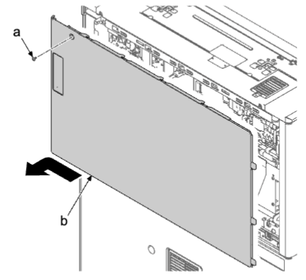
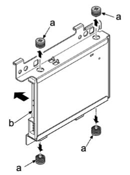
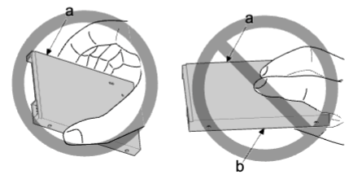

### (4-2)拆卸和安装硬盘驱动器  
1. 拆下螺丝（a）（M3×10），然后朝箭头方向滑动来拆下后部上盖板（b）。  
  
2. 断开两个接插件（a）。  
3. 拆下四颗螺丝（b）（M3×8）。拆下两个卡钩（b）（M3×8）并拆下硬盘组件（c）。    
  
**重要**  
拆下硬盘（a）的接插件时，注意勿对主电路板上的电池施力 。  
否则会导致端子损坏 。 
   
4. 拆下四颗螺丝（a）并拆下硬盘驱动器（b）。  
5. 检查硬盘驱动器（b），然后清洁或更换 。  
6. 重新将部件安装到原来位置 。  
  
•格式化新硬盘时，执行保养模式 U024（参阅 6-38）。  
**重要**  
安装硬盘（a）时请勿触摸电路板表面（b）以免造成损伤 。  
  