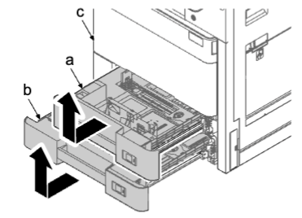
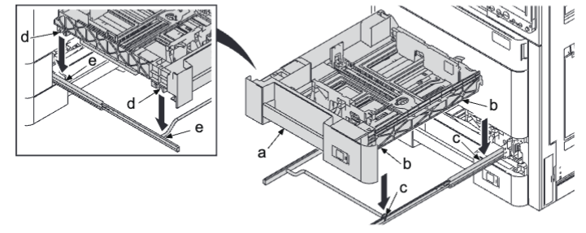
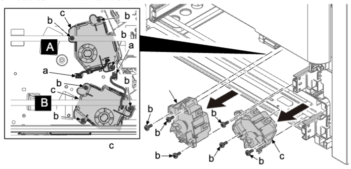
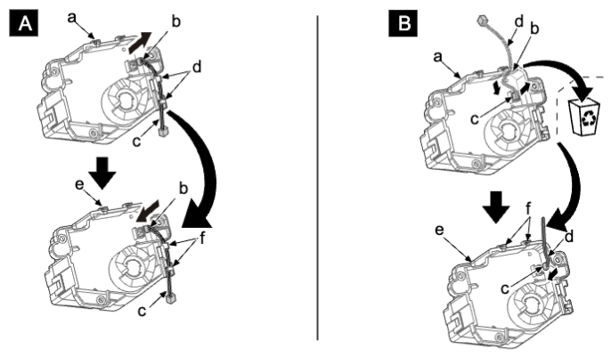
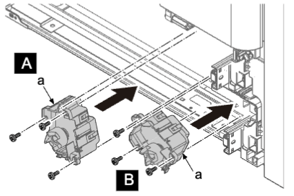

### (4-3) 拆卸和安装提升电机  
1. 从主机（c）拉出上部纸盒（a），并沿箭头方向将其拆下 。  
2. 从主机（c）拉出下部纸盒（b），并沿箭头方向将其拆下 。  
  
### 安装注意事项
安装纸盒（a）时，将定位部件（b）和（d）插入导轨轴和销钉（c）。  
  
3. 断开两个接插件（a）和三颗螺丝（b）（M3×8）。  
4. 拆下提升电机（c）。  
5. 检查提升电机（c），然后清洁或更换 。  
   
### 更换步骤  
### 上侧（A）  
1. 更换提升电机时，从原提升电机（a）断开接插件（b），并松开 2 个卡钩（d）拆下线束（c）。  
2. 连接（b）线束（c）至新提升电机（e）。  
### 下侧（B）  
1. 更换提升电机时，从原提升电机（a）断开接插件（b），并松开 2 个卡钩（d）拆下线束（c）。    
请勿在新提升电机上使用薄膜（b）。  
2. 连接（b）线束（c）至新提升电机（e）。   
请勿用卡钩（f）固定线束（D）。  
  
3. 重新将部件安装到原来位置 。  
   