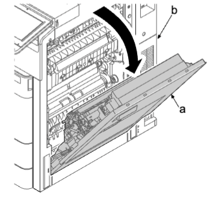
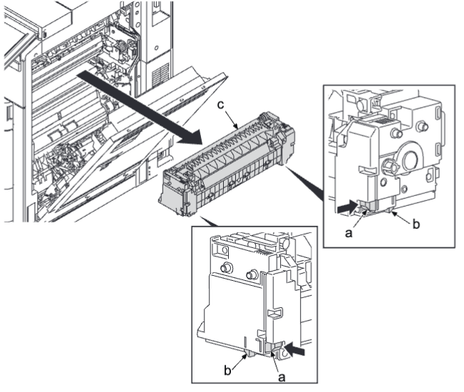
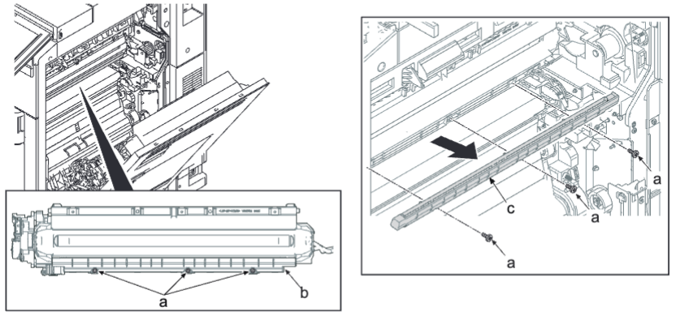

### (4-4)拆卸和安装定影消电单元  
1. 打开主机（b）的右盖板（a）。  
   
2. 按住左和右盖板（a），同时松开卡钩（b），沿箭头方向拆下定影单元（c）。  
   
3. 拆下三颗螺丝（a）（M3×12）。  
4. 从 IH 单元（b）取出定影消电单元（c）。  
5. 更换定影消电单元（c）。  
6. 重新将部件安装到原来位置 。  
   
更换定影消电或 IH 单元后，通过保养模式 U167 [清除] 清除 MC 校正计数器。  
定影计数器清除（保养模式 U127）：清除  