### (4-6) 拆卸和安装废粉盒单元   
### 低端型号  
在就绪模式中拉出墨粉盒（Y、M、C、K）。  
如果墨粉盒盖板（b）被锁定，使用通过保养模式 U033 运行的墨粉盒电磁铁将其打开 。  
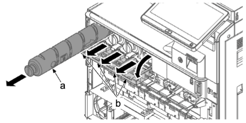   
1. 从主机（c）拉出上部纸盒（a），并沿箭头方向将其拆下 。  
2. 从主机（c）拉出下部纸盒（b），并沿箭头方向将其拆下 。  
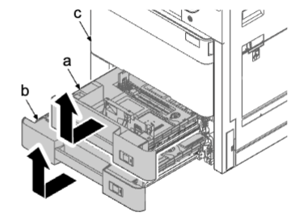   
在就绪模式中拉出墨粉盒（Y、M、C、K）。  
### 安装注意事项  
安装纸盒（a）时，将定位部件（b）和（d）插入导轨轴和销钉（c）。  
   
3. 松开右前盖板（a）的五个卡钩（b），并沿箭头方向将其拆下 。  
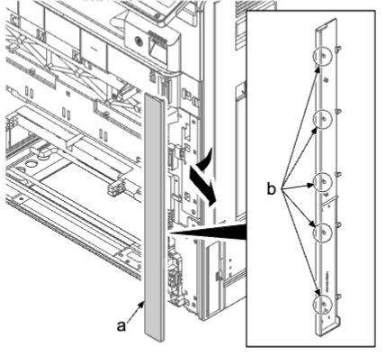   
4. 从保养用前盖板的支点销（a）拆下限位环（b）。  
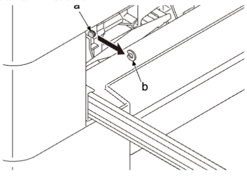   
5. 略微打开前盖板 。  
6. 打开保养用的前盖板（a）。   
7. 拆下皮带（c）的各一颗螺丝（b），并沿箭头方向拆下保养用的前盖板（a）。  
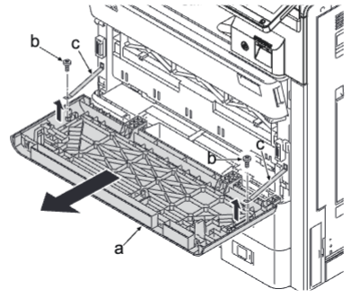   
8. 关闭前盖板（a）。  
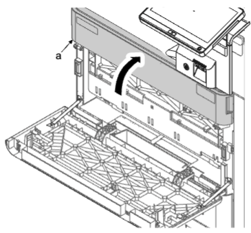   
9.  拆下前盖板（a）的限位器（b）。  
10. 朝箭头方向滑动前盖板，并从支点轴（c）拆下支点（d）。  
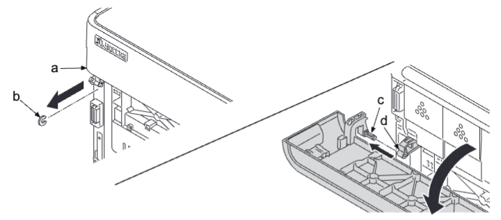   
11. 在弯曲支点的同时拆下销钉（b），并拆下废粉盒盖板（a）。  
   
12. 拆下废粉盒（a）。  
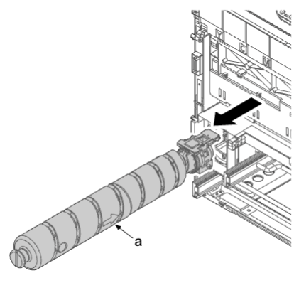   
13. 拉动盖板上的左和右杆（b），打开内部盖板（a）。  
14. 拆下初级转印单元 。  
15. 拆下感光鼓单元 。  
16. 拆下显影单元 。  
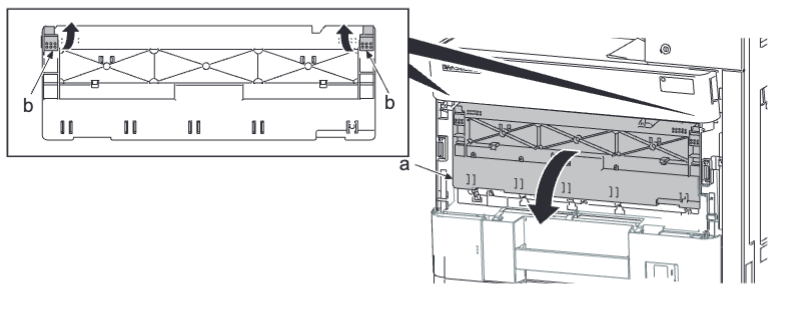   
17. 使用平头螺丝刀（a）松开卡钩（b），沿箭头方向拆下内部盖板（c）。  
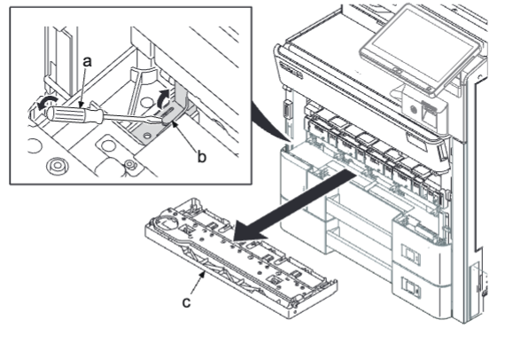   
18. 拆下三颗螺丝（b）（M3×8）。  
19. 拆下一个接插件（a）并拆下前墨粉盒单元（c）。  
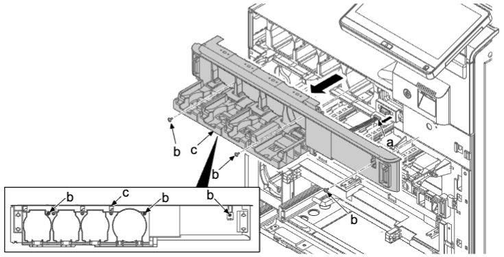   
20. 拆下 2 颗螺丝（a）（M3×10）。  
21. 向下按后部下盖板（b），松开上部肋片，提起到略打开的状态并松开下部卡钩（c）。然后，沿箭头方向将其拆下 。  
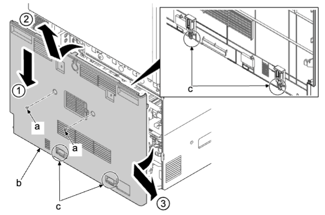   
22. 解锁线夹（a）并从废粉盒单元上的接插件（b）拆下线束（c）。   
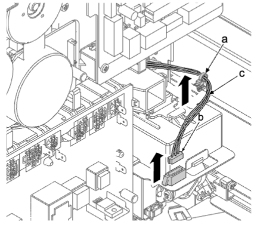   
**重要**  
连接后布置好线束（a）。  
否则线束拉动墨粉盒单元并会造成检测错误或过早检测。  
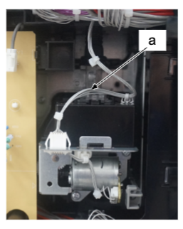   
23. 向上推废粉接头（a）的卡钩（b）以松开限位器（c）并朝自身将其拉出 。  
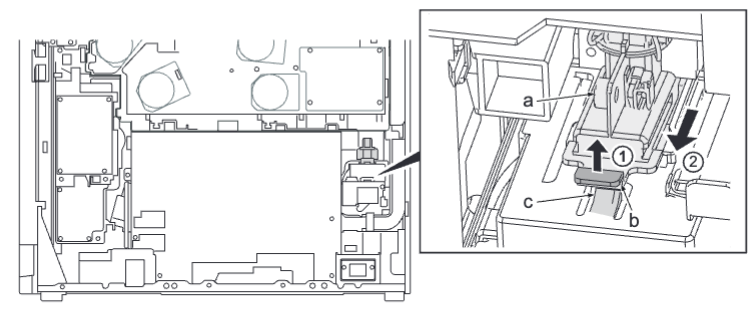  
**重要**  
除非拆下驱动单元而不拆下废粉接头（a），否则废粉接头中的传感器清洁弹簧可能会功能异常。这会导致废粉检测错误 。  
移开废粉盒单元前必须松开废粉接头 。  
24.  拉上部纸盒的导轨（b）并拆下一颗螺丝（a）（M3×8）。  
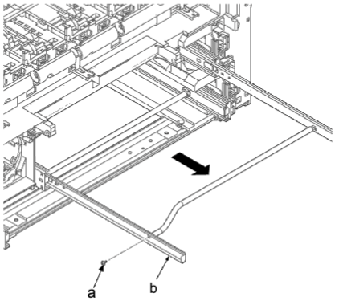  
25. 打开右盖板 。  
26. 拆下右前盖板的两颗螺丝（a）（M3×8）。  
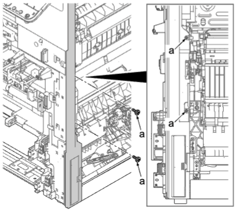  
27. 断开接插件（c）。拆下七颗螺丝（a）（M3×8），然后拆下前内部盖板（b）。  
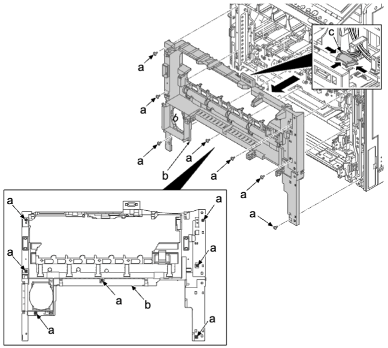  
### 安装注意事项  
放下内部盖板铰链（a），在安装前确认显影单元的加压凸轮（b）已降下 。  
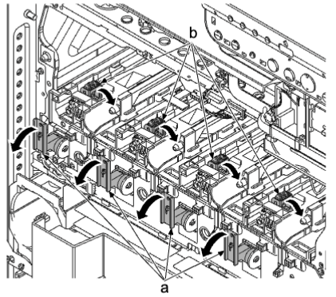  
28. 断开一个接插件（a）。  
29. 拆下两颗螺丝（b）（M3×8）。  
30. 拆下两个卡钩（c）并拆下感光鼓显影中继电路板（d）。  
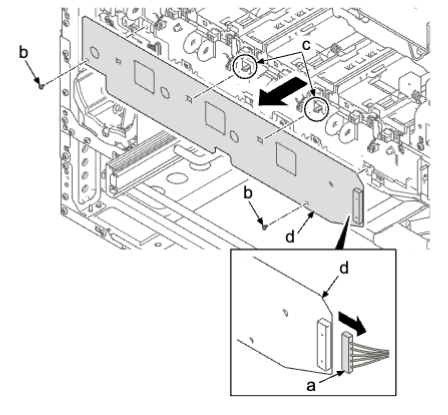  
31. 拆下两颗螺丝（a）（M3×8）。  
32. 松开 4 个卡钩（c），然后沿箭头方向拆下后左盖板（b）。  
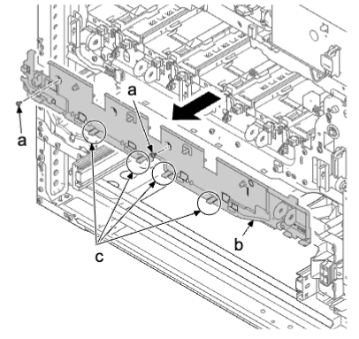  
33. 打开前盖板 。  
34. 拆下两颗螺丝（a）（M3×8）。  
35. 插入平头螺丝刀（c）至前侧开口（b），朝箭头方向将其展宽以松开四个卡钩（d）并拆下左上盖板（e）。  
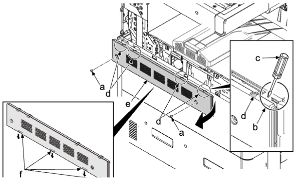  
### 安装注意事项  
先后锁定四个下部卡钩（f）和上部卡钩（d）后安装左上盖板（e）。  
36. 拉出下部纸盒 。  
37. 拆下四颗螺丝（a）（M3×8）。  
38. 提起并拆下四个卡钩（c）并拆下左下盖板（b）。  
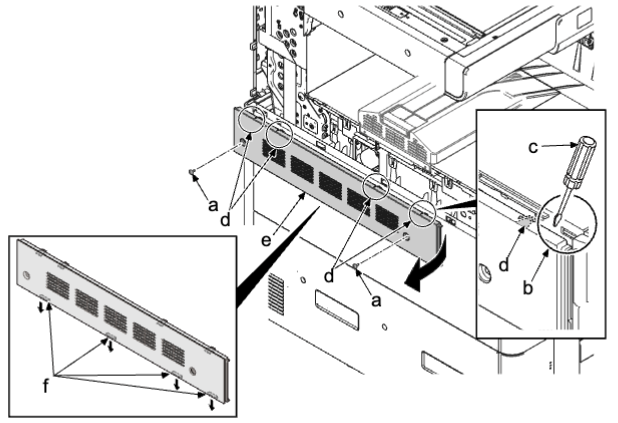  
39. 拆下螺丝（a）（M3×8）。   
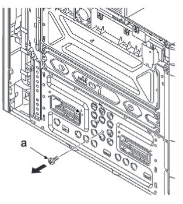  
40. 拆下两颗螺丝（a）（M3×8）并拆下废粉盒单元（b）。  
41. 检查废粉单元（b），然后清洁或更换 。  
42. 重新将部件安装到原来位置 。  
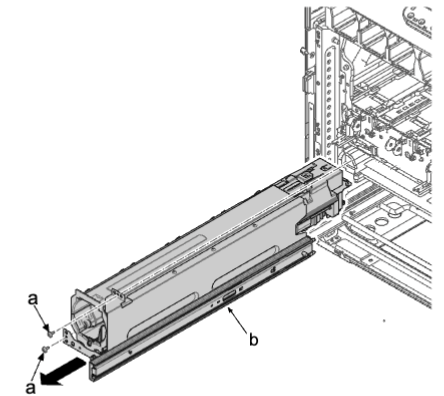  
•更换新的废粉盒单元时，从旧单元（a）拆下两颗螺丝（c）（M3×8）并拆下滑动导轨（b），将其安装至新单元 。  
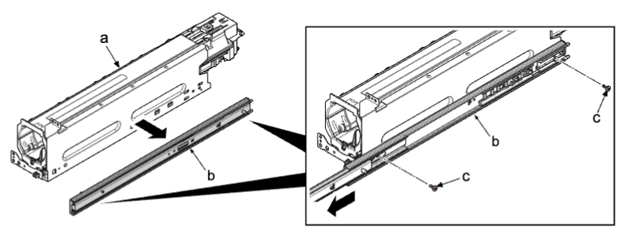   
**更换废粉盒后执行以下设定**。  
废粉瓶重量检测校准（执行保养模式 U155）：校准  
•废粉盒单元的附件  
A：废粉盒单元  
B：废粉瓶  
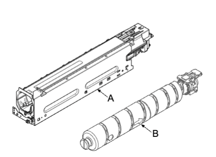   
1. 更换废粉盒而未更换废粉瓶时打开 。  
2. 选择保养模式 U155 并关闭废粉盒盖板 。  
3. 选择 [校准] 并确认 [废粉] 旁显示 [无]，然后按 [开始] 键 。  
4. 确认 [执行] 旁显示 [OK] 。  
5. 插入空的废粉盒并关闭废粉盒盖板（a）。  
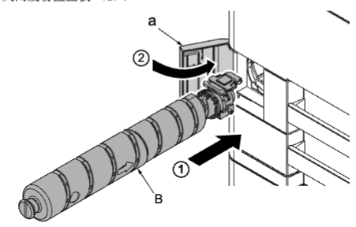   
6. 按 [废粉] 并确认 [无] 变为 [空]，然后按 [执行] 和 [开始] 键 。  
7. 更新 [无／空] 旁的值，并确认 [执行] 旁显示 [OK] 。  
•如果 [执行] 旁显示编号 [错误代码]，请从第一步重新操作 。  
（如果检测到的废粉盒重量不稳定（盒已安装／未安装），则会显示错误）  
### 高端型号  
在就绪模式中拉出墨粉盒（Y、M、C、K）。  
如果墨粉盒盖板（b）被锁定，使用通过保养模式 U033 运行的墨粉盒电磁铁将其打开 。  
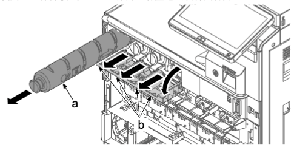   
1. 从主机（c）拉出上部纸盒（a），并沿箭头方向将其拆下 。  
2. 从主机（c）拉出下部纸盒（b），并沿箭头方向将其拆下 。  
在就绪模式中拉出墨粉盒（Y、M、C、K）。  
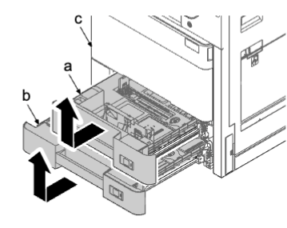   
### 安装注意事项  
安装纸盒（a）时，将定位部件（b）和（d）插入导轨轴和销钉（c）。  
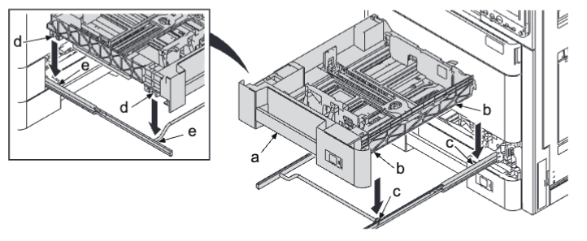   
3. 松开右前盖板（a）的五个卡钩（b），并沿箭头方向将其拆下 。  
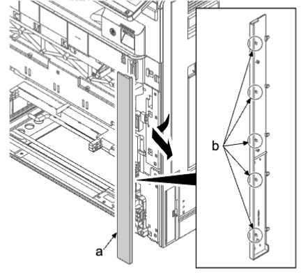   
4. 从保养用前盖板的支点销（a）拆下限位环（b） 。  
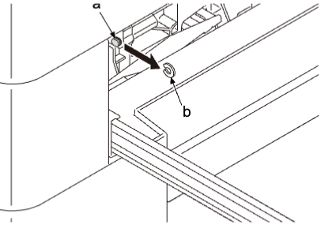   
5. 略微打开前盖板 。  
6. 打开保养用的内部盖板（a） 。  
7. 拆下皮带（c）的各一颗螺丝（b），并沿箭头方向拆下保养用的前盖板（a）。  
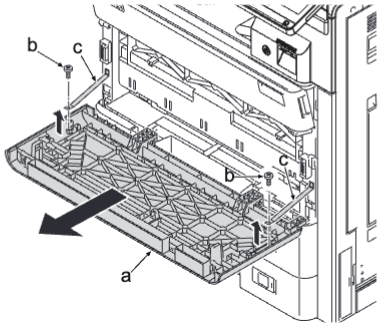   
8. 关闭前盖板（a） 。  
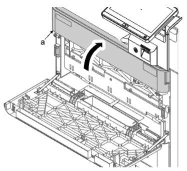   
9.  拆下前盖板（a）的限位器（b） 。  
10. 朝箭头方向滑动前盖板，并从支点轴（c）拆下支点（d） 。  
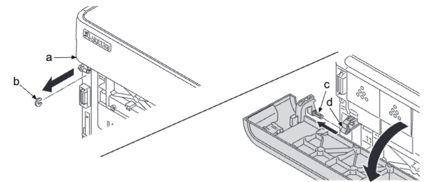   
11. 在弯曲支点的同时拆下销钉（b），并拆下废粉盒盖板（a） 。  
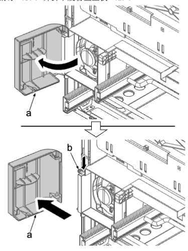   
12. 拆下废粉盒（a） 。  
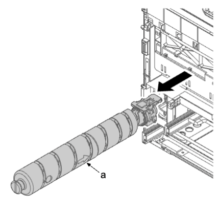   
13. 拉动盖板上的左和右杆（b），打开内部盖板（a） 。  
14. 拆下初级转印单元 。  
15. 拆下感光鼓单元 。  
16. 拆下显影单元 。  
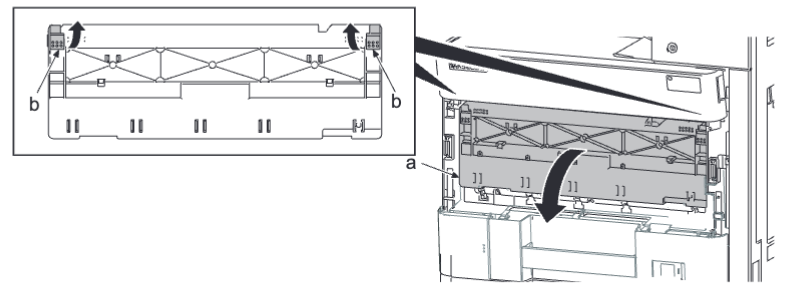   
17. 使用平头螺丝刀（a）松开卡钩（b），沿箭头方向拆下内部盖板（c） 。  
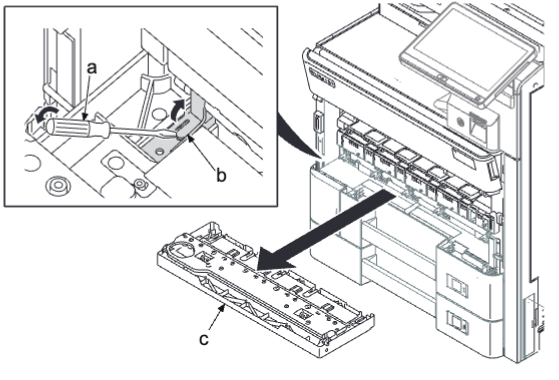   
18. 拆下三颗螺丝（b（M3×8） 。  
19. 拆下一个接插件（a）并拆下前墨粉盒单元（c） 。  
   
20. 拆下两颗螺丝（a）（M3×10） 。  
21. 向下按后部下盖板（b），松开上部肋片，提起到略打开的状态并松开下部卡钩（c）。  然后，沿箭头方向将其拆下 。  
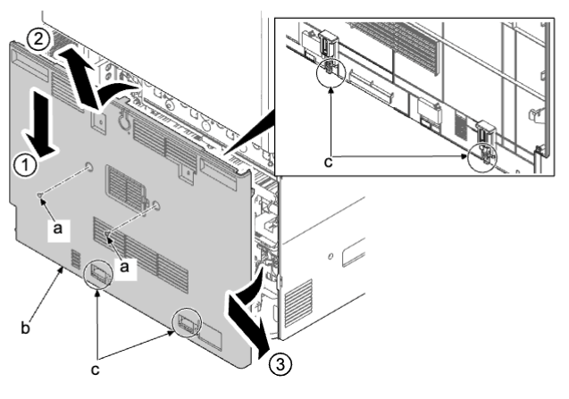   
22. 解锁线夹（a）并从废粉盒单元上的接插件（b）拆下线束（c）。  
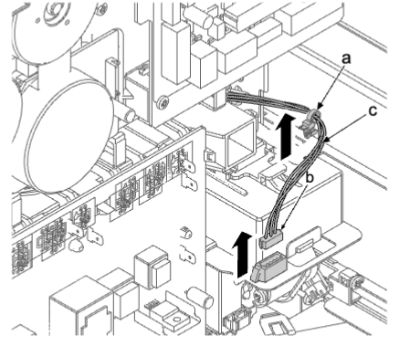   
**重要**  
连接后布置好线束（a）。  
否则线束拉动墨粉盒单元并会造成检测错误或过早检测 。  
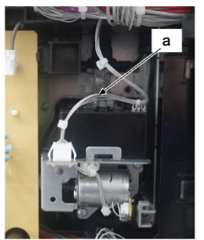   
23. 向上推废粉接头（a）的卡钩（b）以松开限位器（c）并朝自身将其拉出 。  
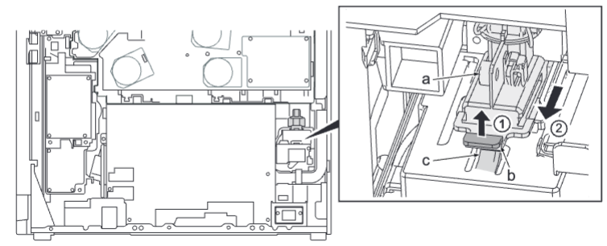   
**重要**  
除非拆下驱动单元而不拆下废粉接头（a），否则废粉接头中的传感器清洁弹簧可能会功能异常。这会导致废粉检测错误 。  
移开废粉盒单元前必须松开废粉接头 。  
24.  拉上部纸盒的导轨（b），拆下一颗螺丝（a）（M3×8）。  
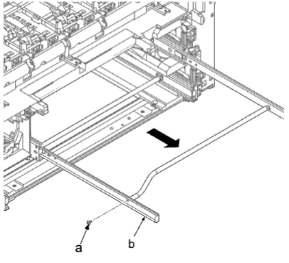   
25. 打开右盖板 。  
26. 拆下右前盖板的两颗螺丝（a）（M3×8） 。  
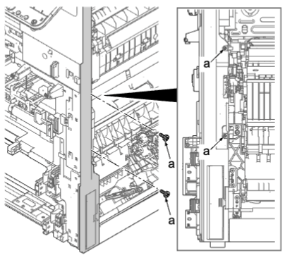   
27. 断开接插件（c）。  拆下七颗螺丝（a）（M3×8），然后拆下前内部盖板（b） 。  
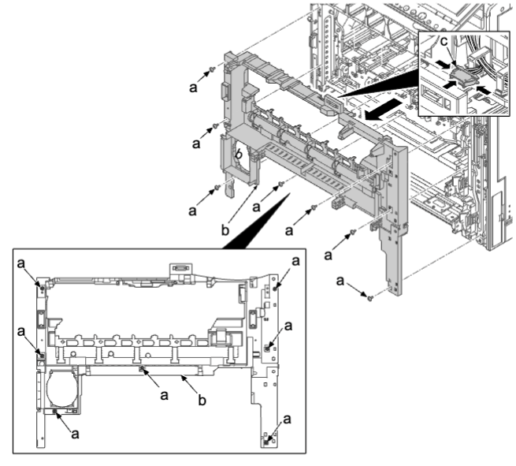   
28. 断开两个接插件（a） 。  
29. 拆下两颗螺丝（b）（M3×8） 。  
30. 拆下两个卡钩（c），拆下感光鼓显影中继电路板（d） 。  
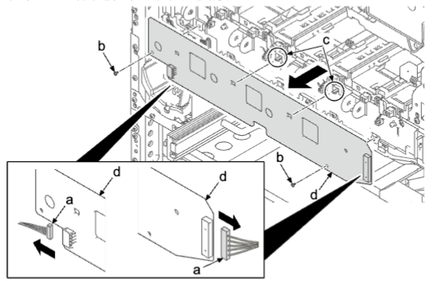   
31. 拆下两颗螺丝（a）（M3×8） 。  
32. 松开 4 个卡钩（c），然后沿箭头方向拆下后左盖板（b） 。  
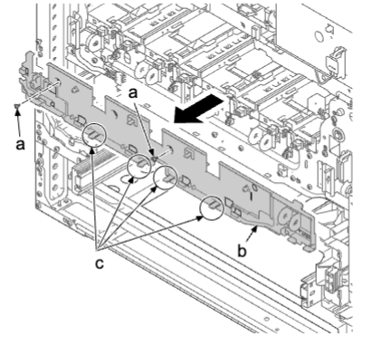   
33. 打开前盖板 。  
34. 拆下两颗螺丝（a）（M3×8） 。  
35. 插入平头螺丝刀（c）至前侧开口（b），朝箭头方向将其展宽以松开四个卡钩（d）并拆下左上盖板（e） 。  
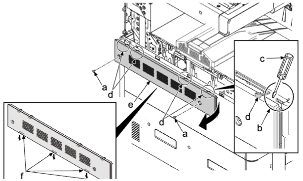   
### 安装时的注意事项
先后锁定四个下部卡钩（f）和上部卡钩（d）后安装左上盖板（e）。  
36.  拉出下部纸盒 。  
37.  拆下四颗螺丝（a）（M3×8） 。  
38.  提起并拆下四个卡钩（c）并拆下左下盖板（b） 。  
   
39. 拆下螺丝（a）（M3×8）。  
   
40. 拆下两颗螺丝（a）（M3×8）并拆下废粉盒单元（b） 。  
41. 检查废粉单元（b），然后清洁或更换 。  
42. 重新将部件安装到原来位置 。  
   
•更换新的废粉盒单元时，从旧单元（a）拆下两颗螺丝（c）（M3×8）并拆下滑动导轨（b），将其安装至新单元 。  
   

**更换废粉盒后执行以下设定。**  
废粉瓶重量检测校准（执行保养模式 U155）：校准  
•废粉盒单元的附件  
A：废粉盒单元  
B：废粉瓶  
   
1. 更换废粉盒而未更换废粉瓶时打开 。  
2. 选择保养模式 U155 并关闭废粉盒盖板 。  
3. 选择 [校准] 并确认 [废粉] 旁显示 [无]。  按 [开始] 键 。  
4. 确认 [执行] 旁显示 [OK] 。  
5. 插入空的废粉盒并关闭废粉盒盖板（a） 。  
   
6. 按 [废粉] 并确认 [无] 变为 [空]，然后按 [执行] 和 [开始] 键 。  
7. 更新 [无／空] 旁的值，确保 [执行] 旁显示 [OK] 。  
• 如果 [执行] 旁显示编号 [错误代码]，请从第一步重新操作 。  
（如果检测到的废粉盒重量波动变化（盒已安装／未安装），则会显示错误） 。  