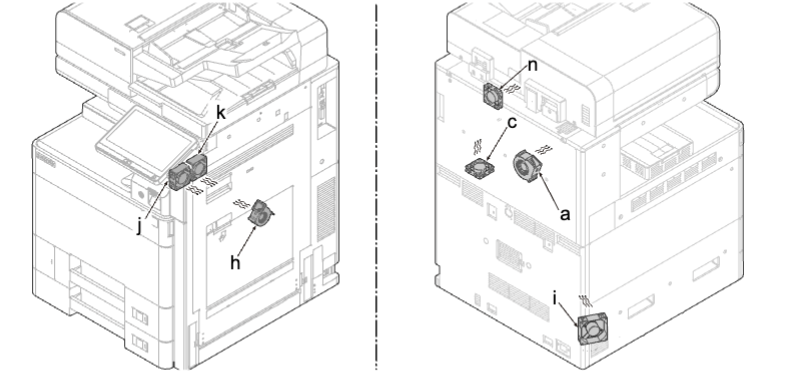
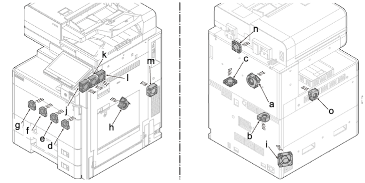

### (4-7) 风扇电机安装方向  
重新安装风扇电机时，请注意安装方向（进气／排气）。  
### 低端型号  
   
### 高端型号  
   
a. IH 电路板风扇电机 进气 *2  
b. 墨粉吸气风扇电机 *a  进气 *3  
c. 控制器风扇电机：进气 进气 *1  
d. 显影风扇电机 K *a 进气 *2  
e. 显影风扇电机 M *a进气 *2  
f. 显影风扇电机 C *a进气 *2  
g. 显影风扇电机 Y *a进气 *2  
h. 定影边缘风扇电机 进气 *2  
i. 电源风扇电机 进气 *2  
j. 出纸／IH 风扇电机前 进气 *2  
k. 出纸／IH 风扇电机中：进气 进气 *2  
l. 出纸／IH 风扇电机中 进气 *2  
m. 墨粉盒风扇电机 1：进气 *2   进气 *2  
n. 出纸风扇电机 进气 *2  
o. 墨粉盒风扇电机 进气 *2  
*1：额定标签侧：上侧， *2：额定标签侧：内侧， *3：额定标签侧：下侧  
*a：仅高端型号  