## (5) 电路板  
**重要**
更换电路板前需要执行以下步骤 。  
否则会损坏电路板 。  
•拔出电源线 。  
•按电源开关超过 1 秒。（消除主机中的电荷。）  
### (5-1) 拆卸和安装引擎电路板
### 低端型号
1. 拆下螺丝（a）（M3×10），然后朝箭头方向滑动来拆下后部上盖板（b）。  
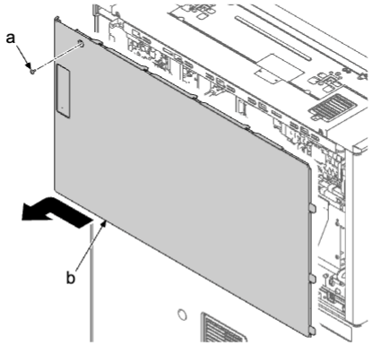   
2. 從引擎電路板（b）斷開所有接插件 。  
3. 拆下六顆螺絲（a）（M3×8），然後拆下引擎電路板（b） 。  
4. 檢查或更換引擎電路板（b），然後在原來位置重新安裝部件 。  
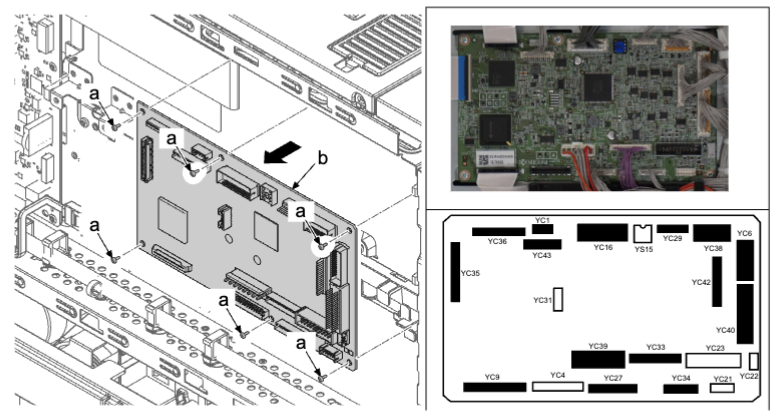   
### 拆卸注意事项  
如果 FFC 接插件（YC35）有锁，请释放锁定盖板（a）并拉出 FFC（b） 。  
   
### 连接 FFC 电缆  
• 如果为 YC9 和 YC36 更换 FFC，请准备一组 FCC 和 2 个接插件，并按如下步骤进行操作 。  
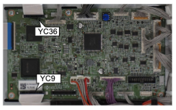   
1. 如图所示连接 FFC 电缆至接插件（c） 。    
• 接插件中心的肋片（c）必须位于 FFC 传导面的对侧 。  
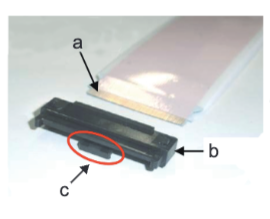   
2. 将 FFC 置于接插件的插槽（d）并按入直至可见传导面 。  
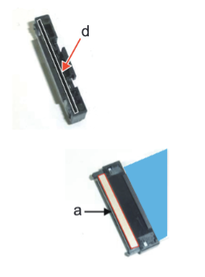   
### 更换引擎电路板的注意事项  
• 更换引擎电路板（a）时，请务必从旧电路板上拆下 EEPROM（b）（YS1）并将其安装到新电路板 。  
• 更换后安装最新的固件 。  
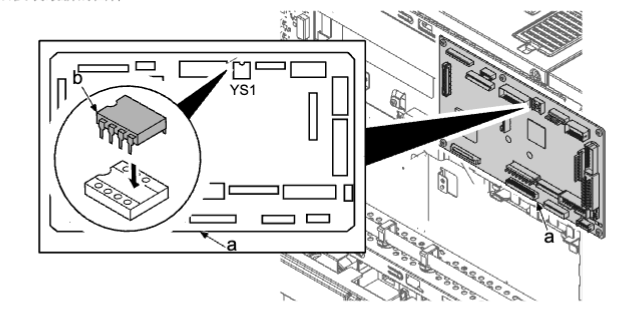   
### 高端型号
1. 拆下一颗螺丝（a）（M3×10），并沿箭头方向滑动后上盖板（b） 。  
   
1. 從引擎電路板（b）斷開所有接插件 。  
2. 拆下八顆螺絲（a）（M3×8），並拆下引擎電路板（b） 。  
3. 檢查或更換引擎電路板（b），然後在原來位置重新安裝部件 。  
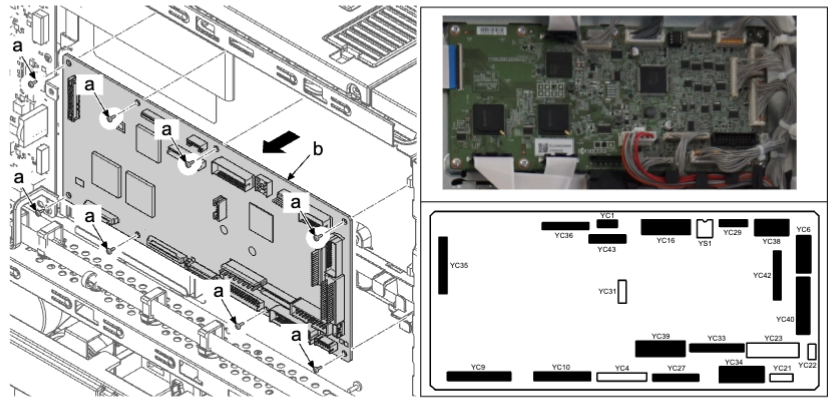   
### 拆卸注意事项  
• 如果 FFC 接插件（YC35）有锁，请释放锁定盖板（a）并拉出 FFC（b） 。  
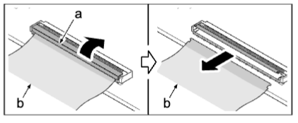   
### 连接 FFC 电缆  
• 如果为 YC9 和 YC36 更换 FFC，请准备一组 FCC 和 2 个接插件，并按如下步骤进行操作 。  
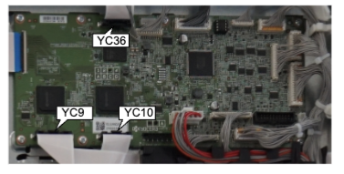   
1. 如图所示连接 FFC 电缆至接插件（c） 。  
• 接插件中心的肋片（c）必须位于 FFC 传导面的对侧 。  
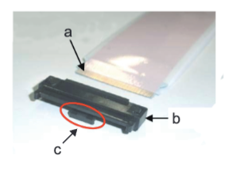   
1. 将 FFC 置于接插件的插槽（d）并按入直至可见传导面 。  
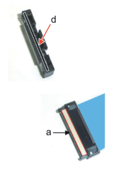   
### 更换引擎电路板的注意事项  
• 更换引擎电路板（a）时，请务必从旧电路板上拆下 EEPROM（b）（YS1）并将其安装到新电路板 。  
• 更换后安装最新的固件 。  
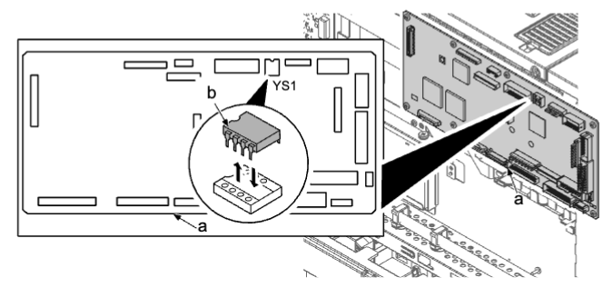