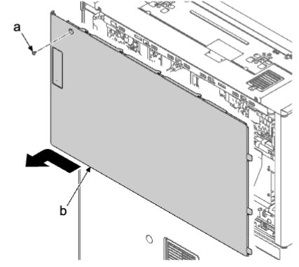
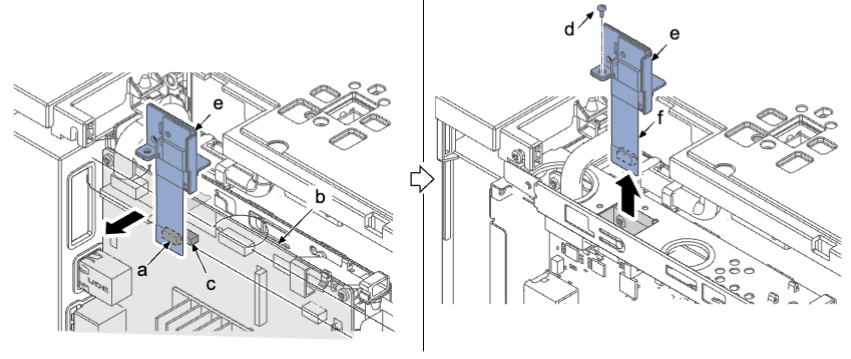
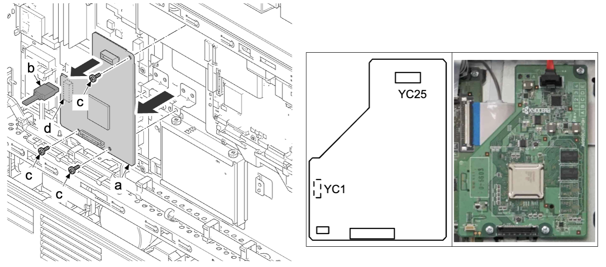
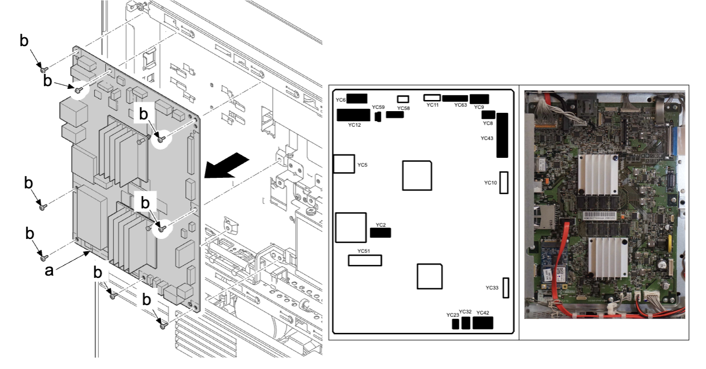
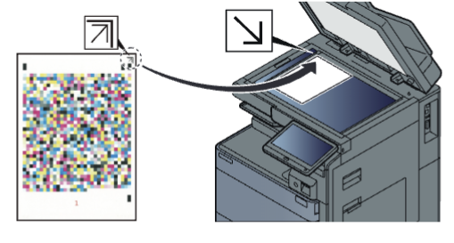
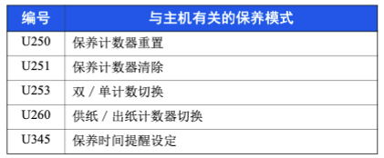

### (5-2) 拆卸和安装主电路板  
1.  拆下螺丝（a）（M3×10），然后朝箭头方向滑动来拆下后部上盖板（b） 。  
   
### 步骤 2 至 3 仅适用于 IB-35）  
1.  从主电路板（b）上的接插件（c）断开接插件（a） 。  
2.  拆下螺丝（d）（M3×6）并取出电路板（e） 。  
3.  拆下螺丝（d）（M3×6）并取出电路板（e） 。  
   
**重要**  
如果从主电路板（b）拆下接插件（a），请直接从电路板（b）拉出而不要采取其他方式拉出 。  
采取其他方式拉出会损坏 FPC（f） 。  
### （步骤 4 至 6 仅适用于送稿器（CIS））  
4.  从送稿器中继电路板（a）断开接插件（b） 。  
5.  拆下三颗螺丝（a）（M3×8） 。  
6.  拆下后侧接插件（d）的同时拆下送稿器中继电路板（a） 。  
   
7.  从主电路板（a）断开所有接插件 。  
8.  拆下八颗螺丝（b）（M3×8），并拆下主电路板（a） 。  
9.  检查主电路板（a），然后根据需要清洁或更换 。  
10.  重新将部件安装到原来位置 。  
   
### 更换主电路板的注意事项  
• 更换主电路板时，请务必从旧的电路板上拆下固态硬盘，并将其安装到新的主电路板。（参阅第 4-136 页）  
**重要**  
主机在没有固态硬盘时不工作 。  
请勿同时更换主电路板、引擎电路板和固态硬盘 。  
操作前，在 U917 中执行数据备份 。  
• 更换主电路板后执行以下设定 。  
## 1  
**在固态硬盘上恢复备份数据 。**  
• 必须在运行 U004 执行该操作 。  
执行保养模式 U026 闪存／恢复  
## 2  
**事先使用 U917 恢复导出的机器设定和作业设定。**  
## 3  
**设定机器序列号**  
• 在没有序列号时打开机器会出现 C0180 错误，因此必须运行 U004 以匹配电路板中的序列号。  
在确认引擎电路板机器序列号匹配主机序列号后执行。U004 中出现不一致时，将会写入错误的数据 。  
1.  使用数字键输入“004”，并按 [开始] 键 。  
2.  选择 [执行] 并按 [开始] 键 。  
3.  关闭电源开关，然后再将其打开。关闭和打开电源之间等待 5 秒以上 。  
## 4  
**固件更新（参阅第 5-1 页）**  
• 检查最新的固件并更新 。  
## 5  
**ID校正操作设定（保养模式 U464）：校准**  
1.  使用数字键输入“464”，并按 [开始] 键 。  
2.  选择 [校准] 。  
3.  选择 [执行] 并按 [开始] 键 。  
• 开始校准 。  
4.  按 [停止] 键 。  
## 6  
**自动半色调调节（保养模式 U410*）**  
1.  使用数字键输入“410” 。  
2.  按 [开始] 键 。  
• 显示执行信息画面 。  
• 在 A4/Letter 纸上输出测试图表 1、2 和 3 。  
3.  在稿台玻璃板上放置测试图表 1，使正面朝下箭头端位于远侧 。  
• 在图表上放置约 20 张白纸 。  
   
1.  按 [开始] 键 。  
• 执行第一次自动调整 。  
1.  显示 [OK] 后，继续使用图表 2 和 3 重复步骤 2 至 3 。  
2.  正常完成后，显示 [完成] 。  
## 7  
• 从事先输出的保养报告（U000）输入设定 。  
   
U251：纸盒计数器  
U265：目的地设定  
U065:主扫描调节值  
U402：装订边设定值  
设置中更改的其他设定  
• 网络认证注册   
• 如果显示自定义画面 U224：主画面安装  
• 如果更改预设值，从 [系统菜单] 设定接口阻止功能或安全等级设定 。  
• 如果安装安全组件，输入按键代码 。  
• 由于 MAC 地址（打印机名称）发生变化，请设定网络 。  
## 8  
**退出保养模式**  
使用数字键输入“001”，并按 [开始] 键 。