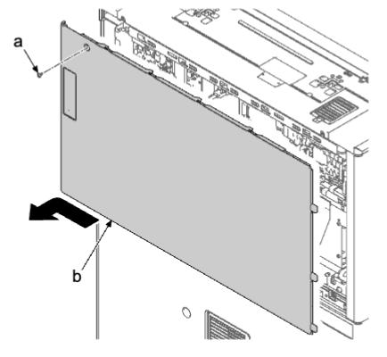
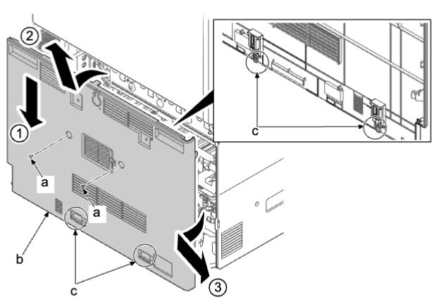
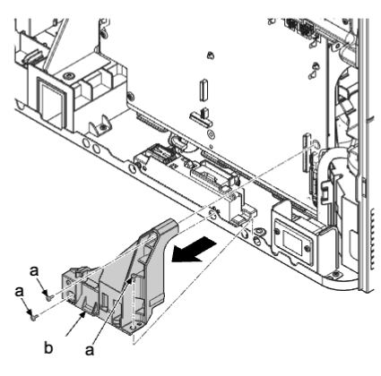
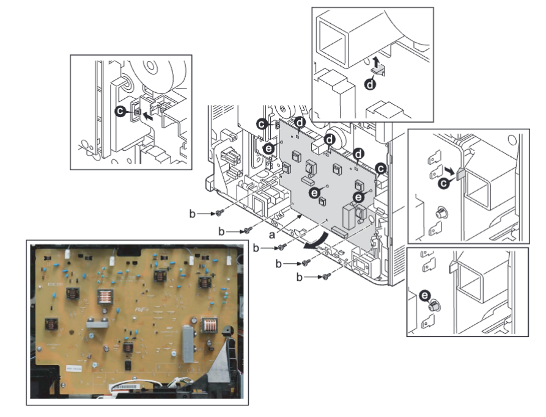
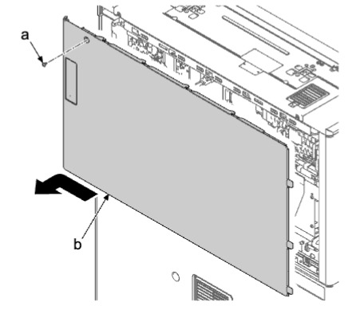
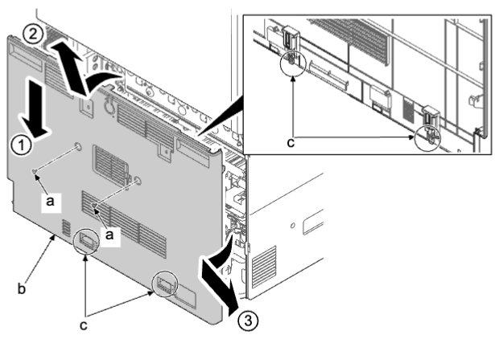
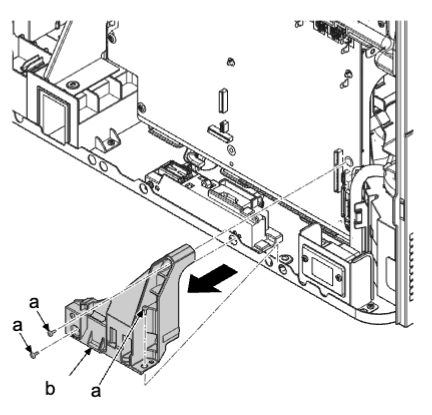
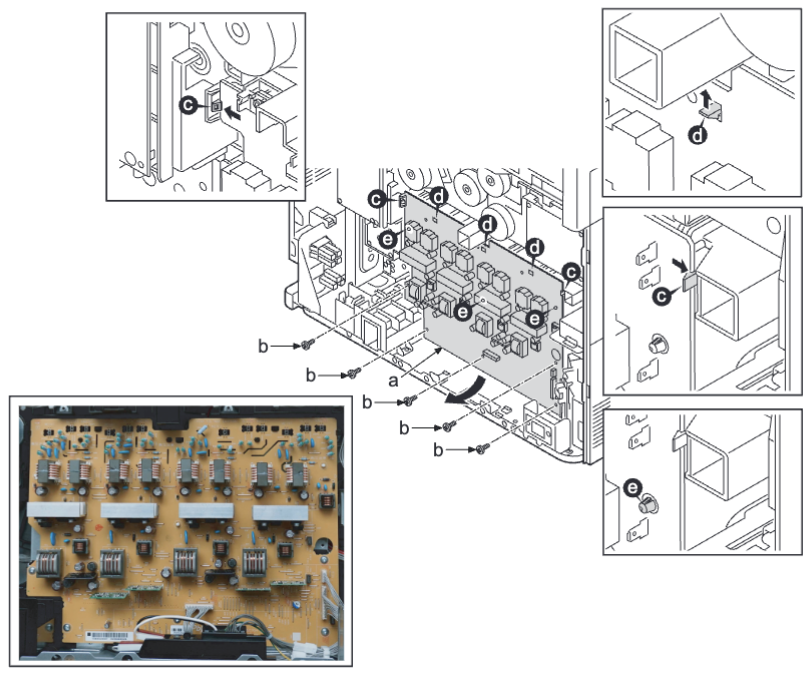

### (5-3) 拆卸和安装主高压电路板  
### 低端型号  
1. 拆下螺丝（a）（M3×10），然后朝箭头方向滑动来拆下后部上盖板（b） 。  
    
2. 拆下两颗螺丝（a）（M3×10） 。  
3. 向下按后部下盖板（b），松开上部肋片，提起到略打开的状态并松开下部卡钩（c）。然后，沿箭头方向将其拆下 。  
    
4. 拆下三颗螺丝（a）（M3×8）  。  
5. 拆下后支杆（b） 。  
    
6. 从主高压电路板（a）断开所有接插件 。  
7. 拆下五颗螺丝（b）（M3×8） 。  
8. 松开三个电路板支脚（e） 。  
9. 松开左侧和右侧的两个卡钩（c） 。  
10. 松开三个上侧卡钩（d）并拆下主高压电路板（a） 。  
11. 检查或更换主高压电路板（a），然后在原来位置重新安装部件 。  
    
### 高端型号
1. 拆下螺丝（a）（M3×10），然后朝箭头方向滑动来拆下后部上盖板（b） 。  
    
2. 拆下两颗螺丝（a）（M3×10） 。  
3. 向下按后部下盖板（b），松开上部肋片，提起到略打开的状态并松开下部卡钩（c） 。  然后，沿箭头方向将其拆下 。  
    
4. 拆下三颗螺丝（a）（M3×8） 。  
5. 拆下后支杆（b） 。  
    
6. 从主高压电路板（a）断开所有接插件 。  
7. 拆下五颗螺丝（b）（M3×8） 。  
8. 松开三个电路板支脚（e） 。  
9. 松开左侧和右侧的两个卡钩（c） 。  
10. 松开三个上侧卡钩（d）并拆下主高压电路板（a） 。  
11. 检查或更换主高压电路板（a），然后在原来位置重新安装部件 。  
    