### (5-4) 拆卸和重新安装转印高压电路板  
1.  拆下螺丝（a）（M3×10），然后朝箭头方向滑动来拆下后部上盖板（b） 。  
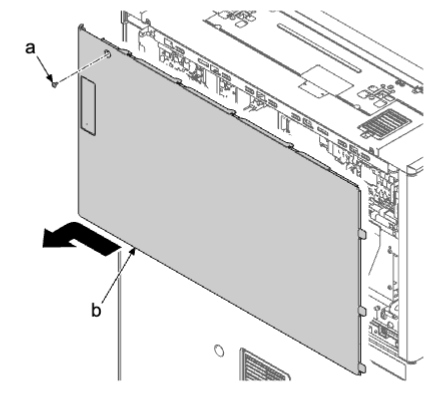    
2.  如果安装了送稿器，将其打开 。  
3.  拆下两颗螺丝（a）（M3×8） 。  
4.  沿箭头方向拆下送稿器后盖板（b） 。  
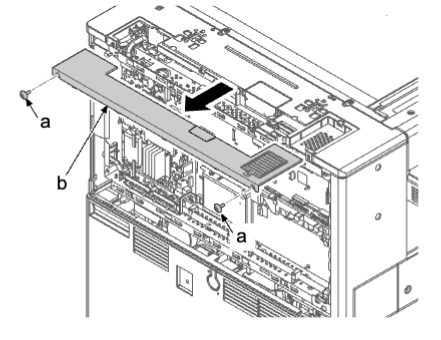    
5.  拆下两颗螺丝（a）（M3×8） 。  
6.  松开两个卡钩（c），沿箭头方向拆下左后盖板（b） 。  
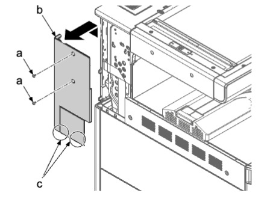    
7.  打开主机（b）的右盖板（a） 。  
    
8.  拆下两颗螺丝（a）（M3×8） 。  
9.  松开卡钩（b）并拆下右侧后上盖板（c） 。  
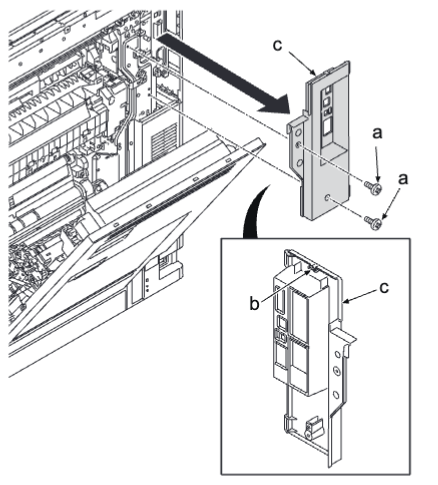    
10.  从主电路板（a）松开四个接插件（b）并从开口（e）取出 。  从两个线束夹（d）拆下线束（c） 。  
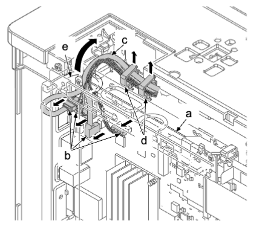    
11.  从引擎电路板断开 FFC 和接插件 。  
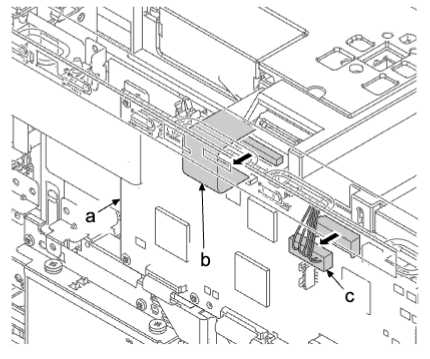    
12.  拆下三颗螺丝（a）（M3×8） 。  
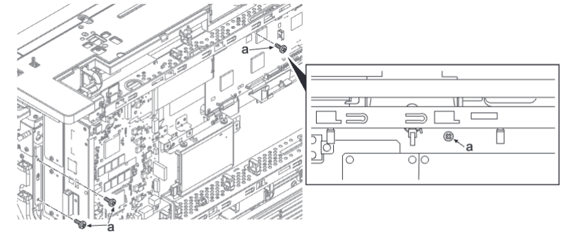    
13.  提起护罩盒（a）后，将其取出并松开卡钩（b） 。  
14.  打开护罩盒（a） 。  
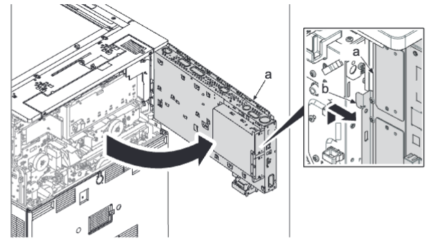  
**注意**  
如果在打开护罩盒的情况下在机器的后下侧进行操作，注意防止头部触碰护罩盒 。  
15.  從墨粉盒電機（a）拆下接插件（b） 。 從供紙圖像電路板（c）拆下 10 個接插件（d） 。  
16.  從五個線束夾（f）拆下線束（e） 。  
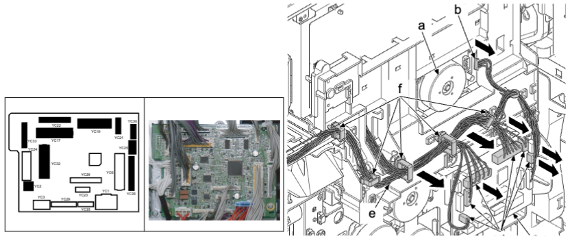    
17.  拆下兩顆螺絲（a）（M3×8） 。  
18.  使用平頭螺絲刀（b）依次鬆開六個上側卡鉤（c）和四個下側卡鉤（c），然後拆下轉印端子蓋板（d） 。  
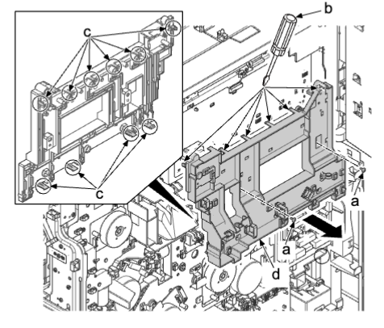    
```
**重要**  
安装转印端子盖板（a）时，确保肋片（b）处于两个端子之间。（八个位置）  
```
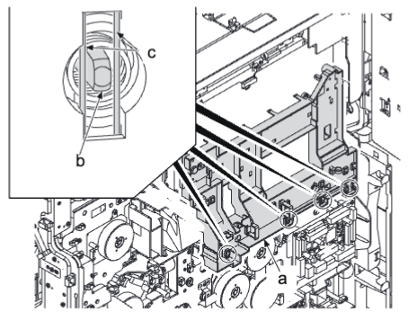    
19.  从转印高压电路板（a）断开一个接插件（b） 。  
20.  拆下两颗螺丝（c）（M3×8） 。  
21.  松开两个电路板支脚（b）并拆下转印高压电路板（a） 。  
22.  检查或更换转印高压电路板（a），然后在原来位置重新安装部件 。  
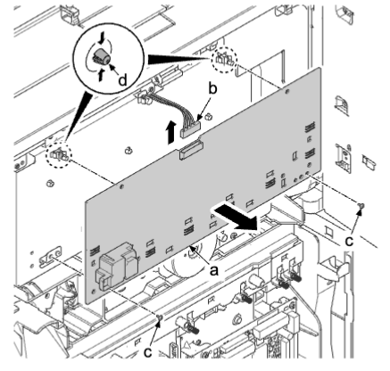