### (5-5) 拆卸和安装电源电路板  
**注意**  
即使关闭电源并拔下电源插头，电源电路板上的某些电容器也可能带电，因此请小心勿触摸这些部件 。  
#### **低端型号**  
1. 拆下两颗螺丝（a）（M3×10） 。  
2. 向下按后部下盖板（b），松开上部肋片，提起到略打开的状态并松开下部卡钩（c）。然后，沿箭头方向将其拆下 。  
    
3. 拆下三颗螺丝（a）（M3×8） 。  
4. 拆下后支杆（b） 。  
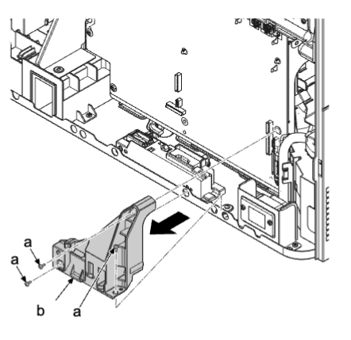    
5. 断开两个接插件（c） 。  
6. 拆下螺丝（b）（M3×8）并拆下接地端子（c） 。  
7. 拆下线束夹（d） 。  
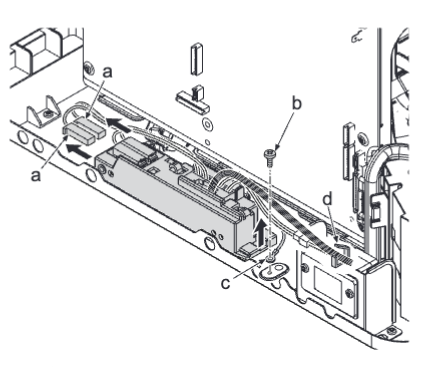    
8. 拆下一颗螺丝（a）（M3×8） 。  
9. 扣动以从凹槽（d）中松开，从而取出 PF 纸匣支架（c） 。  
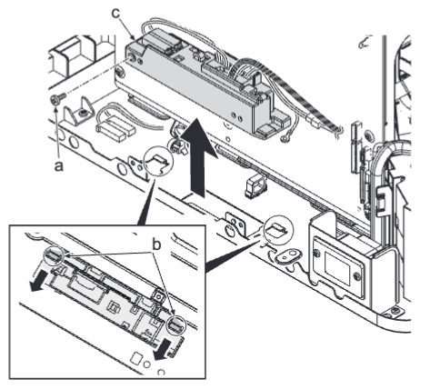    
**重要**  
安装 PF 纸匣支架（c）时，确保将其挂至两个凹槽（b） 。  
10. 从主高压电路板（a）断开所有接插件 。  
11. 拆下五颗螺丝（b）（M3×8） 。  
12. 松开三个电路板支脚（e） 。  
13. 松开左侧和右侧的两个卡钩（c） 。  
14. 松开三个上侧卡钩（d）并拆下主高压电路板（a） 。  
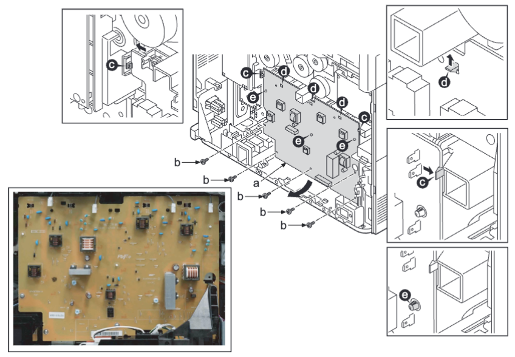    
15. 拆下两颗螺丝（a）（M3×8）并拆下保护盖（b） 。  
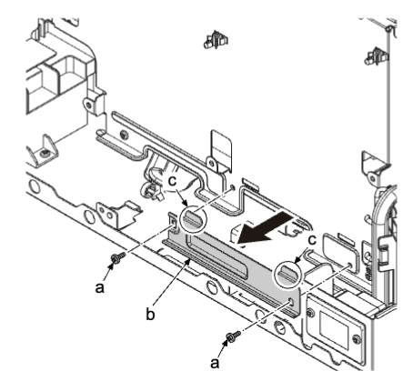    
16. 拆下四颗螺丝（a）（M3×8） 。  
17. 事先旋转以拔出下侧并拆下电源护罩（b） 。  
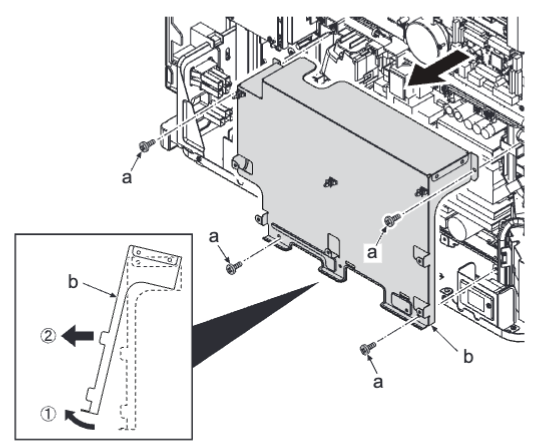    
18. 从电源电路板（a）断开所有接插件 。  
19. 拆下五颗螺丝（b）（M3×8） 。  
20. 松开两个电路板支脚（c）并拆下电源电路板（a） 。  
21. 检查或更换电源电路板（a），然后在原来位置重新安装部件 。  
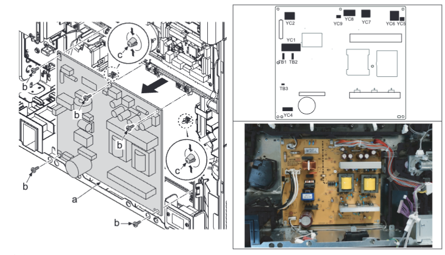    
#### 高端型号
22. 拆下两颗螺丝（a）（M3×10） 。  
23. 向下按后部下盖板（b），松开上部肋片，提起盖板以松开下部卡钩（c）。然后，沿箭头方向将其拆下 。  
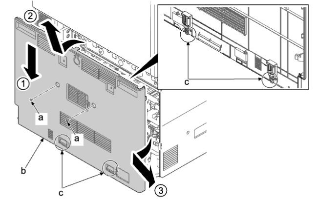    
24. 拆下三颗螺丝（a）（M3×8） 。  
25. 拆下后支杆（b） 。  
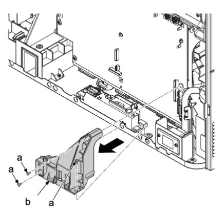    
26. 断开两个接插件（a） 。  
27. 拆下螺丝（b）（M3×8）并拆下接地端子（c） 。  
28. 拆下线束夹（d） 。  
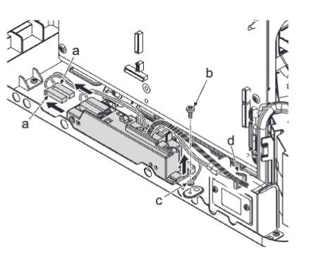    
29. 拆下一颗螺丝（a）（M3×8） 。  
30. 扣动以从凹槽（d）中松开，从而取出 PF 纸匣支架（c） 。  
    
**重要**  
安装 PF 纸匣支架（c）时，确保将其挂至两个凹槽（b） 。  
31. 从主高压电路板（a）断开所有接插件 。  
32. 拆下五颗螺丝（b）（M3×8） 。  
33. 松开三个电路板支脚（e） 。  
34. 松开左侧和右侧的两个卡钩（c） 。  
35. 松开三个上侧卡钩（d）并拆下主高压电路板（a） 。  
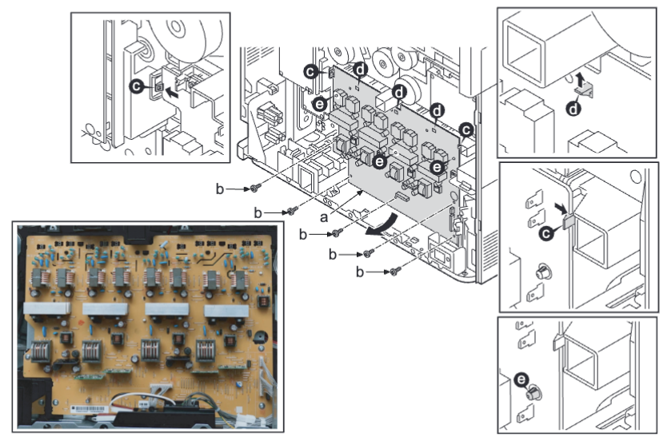    
36. 拆下两颗螺丝（a）（M3×8）并拆下保护盖（b） 。  
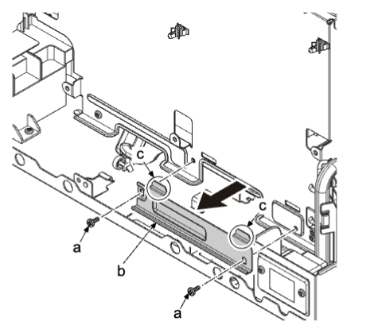    
37. 拆下四颗螺丝（a）（M3×8） 。  
38. 事先旋转以拔出下侧并拆下电源护罩（b） 。  
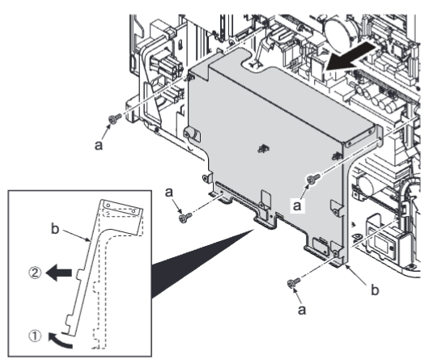  
39. 从电源电路板（a）断开所有接插件 。  
40. 拆下五颗螺丝（b）（M3×8） 。  
41. 松开两个电路板支脚（c）并拆下电源电路板（a） 。  
42. 检查或更换电源电路板（a），然后在原来位置重新安装部件 。  
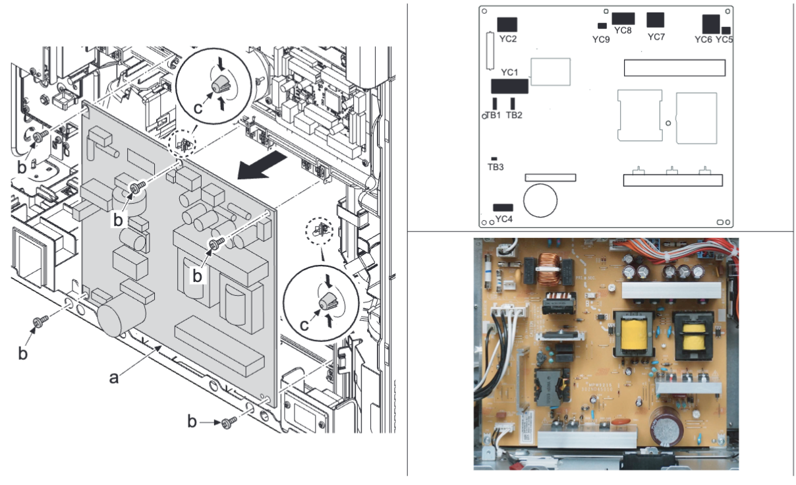  