### (5-6) 拆卸和安装 IH 电路板  
1. 提起操作面板（a） 。  
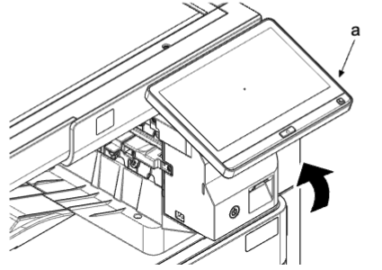    
2. 向上提副托盘（a）的杆（b）并松开锁定，然后提起机器后侧（c）并将其滑至前侧 。  
3. 向上提销钉（d）并将其拆下，然后拆下副托盘（a） 。  
4. 拆下一颗螺丝（e）（M3×8） 。  
5. 拆下接插件盖板（f） 。  
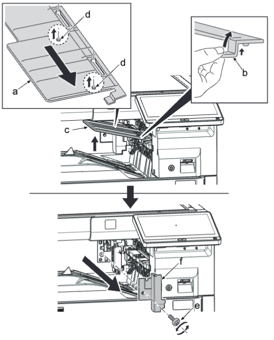    
### 如果安装了作业分离器  
1. 拆下一颗螺丝（a）（M3×8） 。  
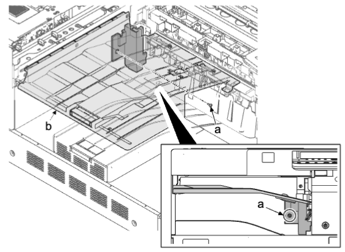    
2. 提起上部托盘（a）的杆（b），松开锁定并沿箭头方向滑动，拔出销钉（c）并沿箭头方向拆下 。  
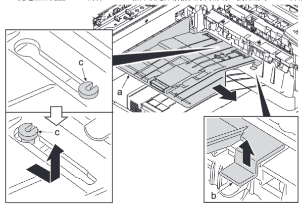    
3. 拆下两颗螺丝（a）（M3×8） 。  
4. 松开两个卡钩（c），沿箭头方向拆下左后盖板（b） 。  
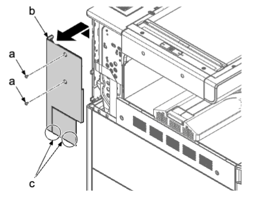    
5. 打开前盖板 。  
6. 拆下两颗螺丝（a）（M3×8） 。  
7. 将平头螺丝刀（c）插入开口的前侧，沿箭头方向拨动并松开四个卡钩（d），然后拆下左上盖板（e） 。  
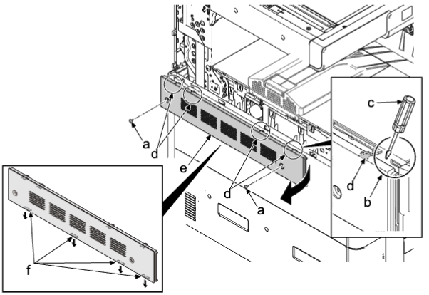    
#### **安装注意事项**
先锁定四个下部卡钩（f）和上部卡钩（d），然后安装左上盖板（e） 。  
8. 沿箭头方向拆下副托盘（a） 。  
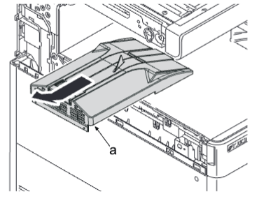    
9. 拆下三颗螺丝（a）（M3×8） 。  
10. 沿箭头方向拆下送稿器后盖板（b） 。  
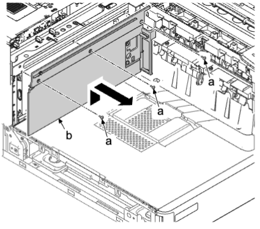    
11. 拆下一颗螺丝（a）（M3×8） 。  
12. 拆下传感器安装板（b） 。  
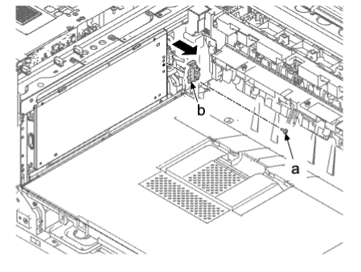    
13. 拆下四颗螺丝（a）（M3×8） 。  
14. 拆下 IH 屏蔽板（b） 。  
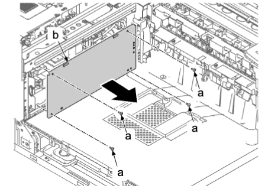    
15. 从 IH 电路板（b）断开所有接插件 。  
16. 拆下六颗螺丝（a）（M3×8） 。  
17. 松开 3 个电路板支脚（c）并拆下 IH 电路板（b） 。  
18. 检查或更换 IH 电路板（b），然后在拆下位置重新安装部件 。  
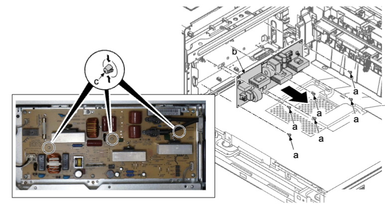