### (5-7) 拆卸和安装操作面板电路板  
1. 立起操作面板（a） 。  
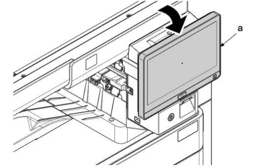    
2. 将手指插入 ISU 前右盖板（b）的开口（c）并朝自身方向拉动，松开四个下部卡钩（d）。沿箭头方向松开六个上部卡钩（e）以将其拆下 。  
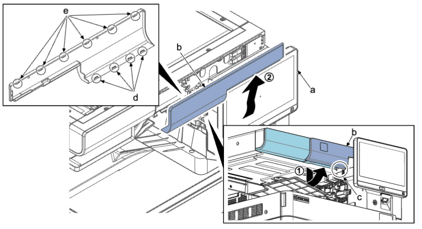    
3. 拆下螺丝（a）（M3×8） 。  
4. 使用平头螺丝刀（c）松开两个肋片（d） 。  
5. 沿箭头方向拆下出纸上盖板（b） 。  
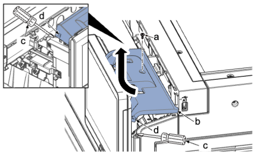    
6. 拆下一颗螺丝（a）（M3×8） 。  
7. 沿箭头方向从操作单元（b）拆下操作盖（c） 。  
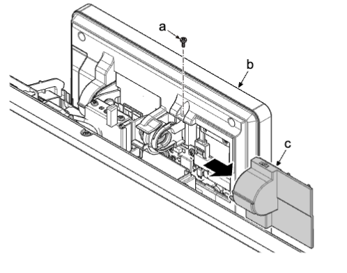    
8. 从操作单元（a）断开 4 个接插件（b） 。  
9. 拆下线束导板（c） 。  
10. 拆下两颗螺丝（d）（M3×8） 。  
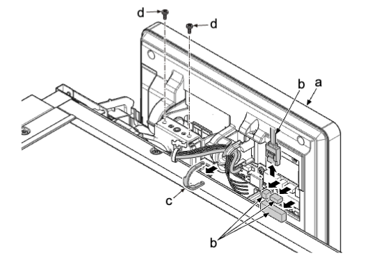    
在就绪模式中拉出墨粉盒（Y、M、C、K） 。  
如果墨粉盒盖板（b）被锁定，使用通过保养模式 U033 运行的墨粉盒电磁铁将其打开 。  
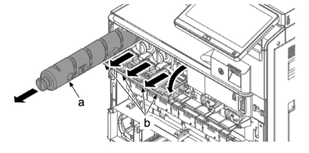    
11. 拆下三颗螺丝（b）（M3×8） 。  
12. 拆下一个接插件（a）并拆下前墨粉盒单元（c） 。  
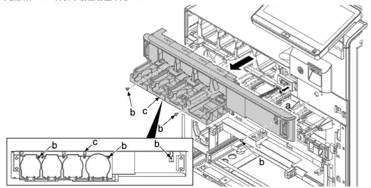    
13. 提起操作面板（a） 。  
14. 使用平头螺丝刀解锁两个卡钩（b）并拆下前盖板（d） 。  
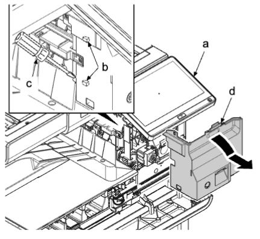    
#### 安装注意事项  
安装前盖板（d）时，插入两个下部卡钩完全锁定卡钩（b） 。  
15. 拆下两颗螺丝（a）（M3×8）并拆下操作部（b） 。  
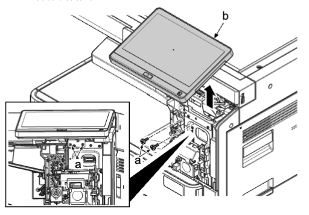    
16. 拆下螺丝（a）（M3×8） 。  
17. 松开两个卡钩（b），然后沿箭头方向拆下操作单元盖（c） 。  
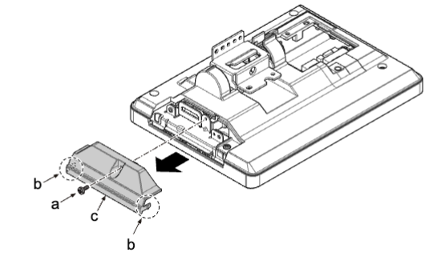    
18. 如果支架位于下部，然其旋转到上部 。  
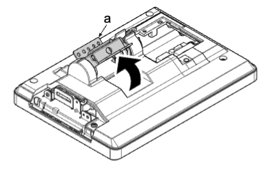    
19. 拆下 4 颗螺丝（a）（M3×8）并从操作部（b）拆下操作后盖板（c） 。  
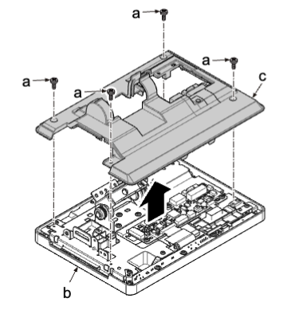    
20. 拆下 2 颗螺丝（g）（M3×8）并从操作部（b）拆下操作后下盖板（e） 。  
    
21. 从操作电路板（c）断开所有 FFC、FPC 和接插件 。  
22. 拆下 4 颗螺丝（a）（M3×8）并从操作部（b）拆下操作面板主电路板（c） 。  
23. 检查或更换操作面板主电路板（c），然后重新安装拆下的部件 。  
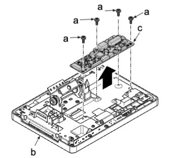  