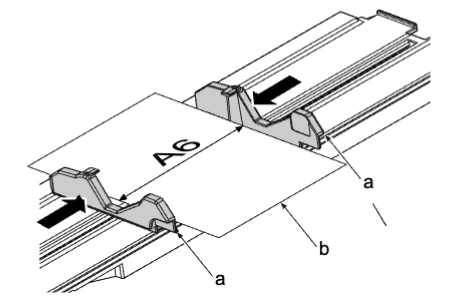
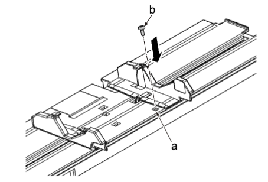
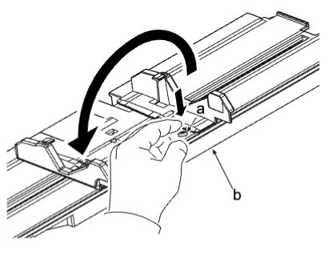
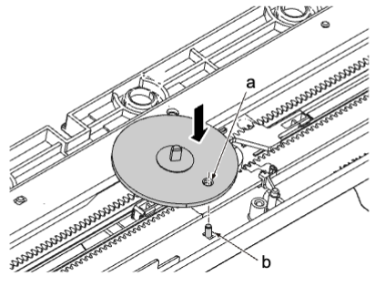
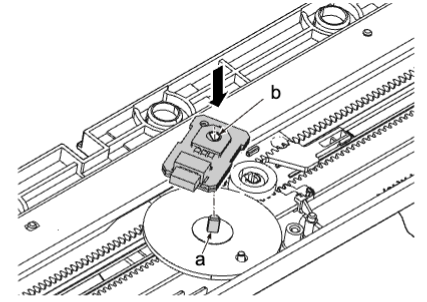
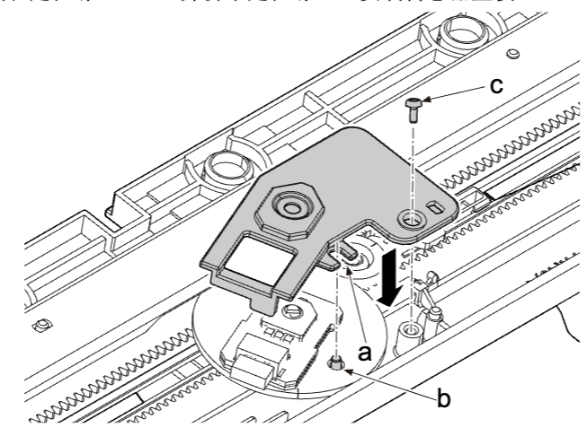

## (6) 传感器调节  
### (6-1) 安装手送纸盘纸张宽度传感器  
1. 将手送纸盘纸张宽度导板设至 A6 尺寸 。  
    
2. 将定位销（b）插入到手送纸盘提升板上的方孔（a） 。  
    
3. 固定定位螺丝（a）颠倒手送纸盘提升板（b） 。  
    
4. 将定位螺丝（a）插入到齿轮的孔中并将其安装 。  
    
5. 对齐手送纸盘纸张宽度传感器的 D 切口至 D 切口轴并将其安装 。  
    
6. 对齐切口传感器盖板和定位螺丝（b）并拆下定位螺丝。安装传感器盖板 。  
    